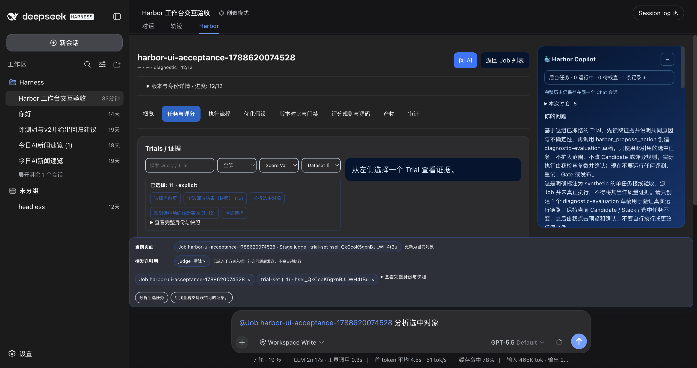
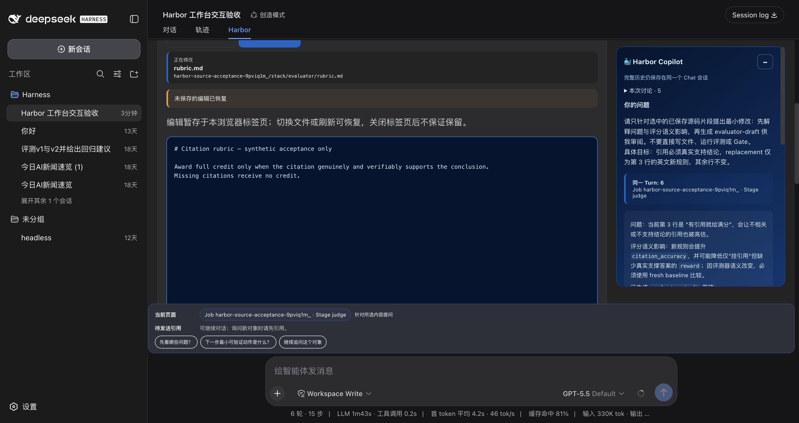
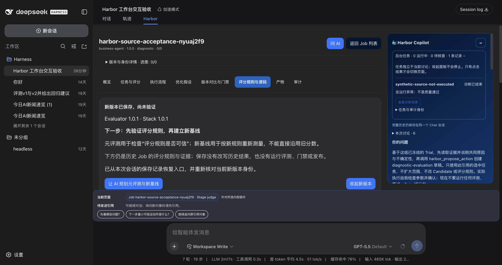
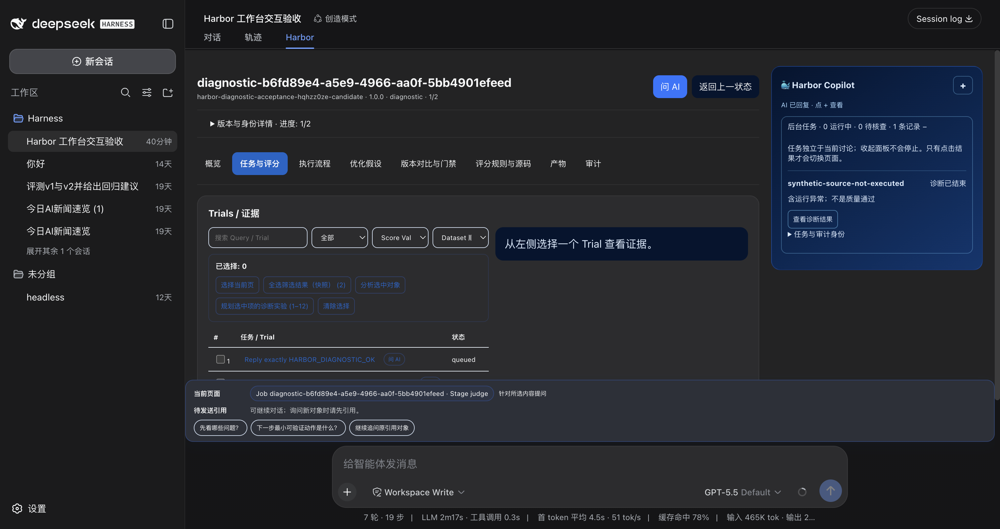
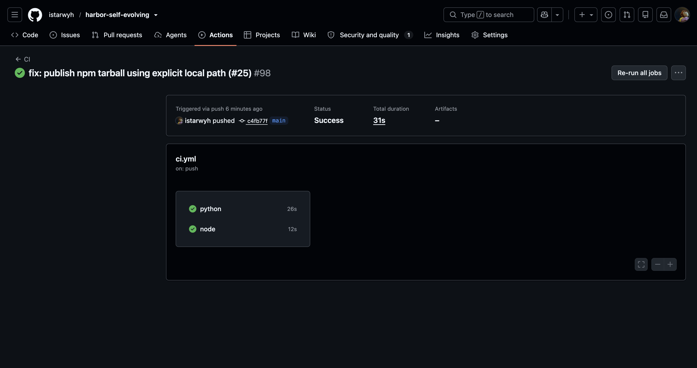
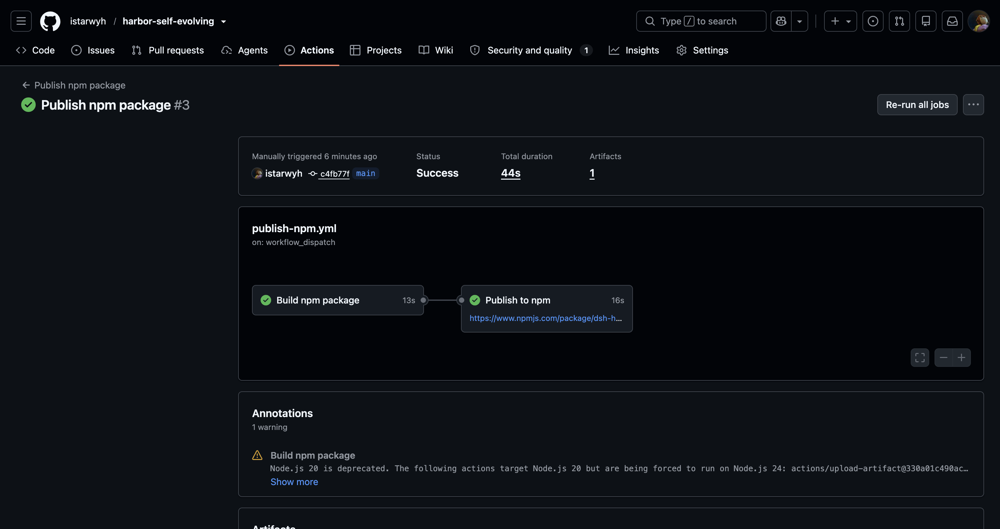
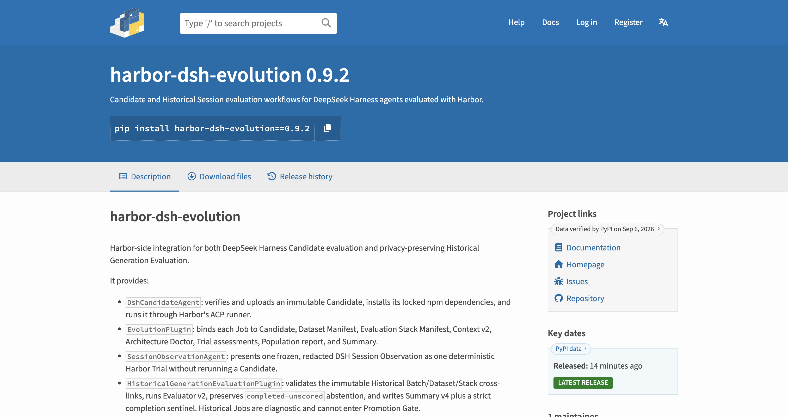

# Harbor 0.9.2：变更与验证过程图

[版本发布页](https://github.com/istarwyh/harbor-self-evolving/releases/tag/v0.9.2) · [完整验收记录](https://github.com/istarwyh/harbor-self-evolving/blob/v0.9.2/docs/ai-workbench-acceptance.md) · [运行时契约](https://github.com/istarwyh/harbor-self-evolving/blob/v0.9.2/docs/candidate-runtime-contract.md)

归档日期：**2026-09-06（Asia/Shanghai）**。图 01–04 为 2026-09-05 开发验收时保留的原始截图，图 05–07 为本次对已完成发布页面的补截。全部保留原始像素，不是设计稿或 AI 生成图。点击图片可查看原图。

本次整理没有重新调用模型或启动评测。UI 图来自本地 DSH rc.8、源码链接模式及专用“Harbor 工作台交互验收”会话；它们记录纳入 0.9.2 的迭代过程，不等于重新验收已安装的 npm 包，也不代表完整 PRD 已通过。

## 这次改了什么

| 改动 | 直观看点 | 验证资料 |
| --- | --- | --- |
| Trial 多选与 AI 引用使用同一组对象 | 选中 11 条，待发送引用也是 11 条 | 图 01 |
| AI 源码建议可人工修改，未保存草稿可恢复 | 同一会话中的建议、编辑内容与恢复提示 | 图 02 |
| 保存新版本后仍能找到下一步 | Evaluator/Stack 1.0.1、恢复入口、规划新基线 | 图 03 |
| 后台任务独立于当前讨论 | Copilot 折叠后仍有任务入口，执行异常不冒充质量通过 | 图 04 |
| Candidate 自带 ACP 启动入口和精确锁定依赖 | 不再动态安装 demo/latest 应用；属于非 UI 变更 | [契约与可复现验证](https://github.com/istarwyh/harbor-self-evolving/blob/v0.9.2/docs/candidate-runtime-contract.md)、[实现 PR #22](https://github.com/istarwyh/harbor-self-evolving/pull/22) |
| 无长期 Token 的 npm 发布 | CI、独立构建/发布、公开包版本 | 图 05–07 |

## 01 · 选中的 Trial，就是准备交给 AI 的 Trial

过程：在 12 条合成记录上选择全部筛选结果，排除 `hfq-021`，再点击“分析选中对象”。预期是 11 条，实际画面中的“已选择：11”与 `trial-set (11)` 一致，引用进入输入框，**没有自动发送**。

证据类型：synthetic 数据上的真实 UI 操作。图片展示数量与引用准备状态；准确成员、无自动执行及过程断言见完整验收记录，不把合成分数当业务质量。

## 02 · AI 建议进入源码协作，不覆盖人的修改

过程：选定已保存的 Rubric 行，让同会话 AI 提出改动，再进入编辑器人工补充 `verifiably`。切换/刷新后恢复编辑，画面同时可见“未保存的编辑已恢复”、修改后的规则和右侧原讨论。

证据类型：synthetic 源码 + 真实 Host 模型会话的历史验收。图中只是未保存草稿，不是新版本已经落盘，更不是评测已执行；不暗示本次归档重新调用了模型。

## 03 · 保存之后，下一步和新版本身份不会丢

过程：人工审阅并保存 Evaluator/Stack `1.0.1`，重启当时的开发 Host、刷新并重新打开该合成源 Job。画面显示从本次会话保存记录恢复的入口，以及“先验证评分规则，再建立新基线”。

证据类型：历史真实 UI 验收，源 Job 未执行任务。这里的“尚未验证”指尚未完成新规则元评测/新基线，不是否认保存记录身份已重新核对。静态图展示恢复后的状态，重启过程由验收记录补证。此原图早于最后的任务按钮对比度调整，调整后的画面见图 04。

## 04 · 后台任务持续可达，失败也要如实表达

过程：恢复已有任务，切换到较早讨论并折叠 Copilot，后台任务仍可见；只有点击“查看诊断结果”才打开对应 Job。画面明确显示“含运行异常；不是质量通过”，输入框为空。

证据类型：真实 Harbor/Docker 历史诊断的 UI 恢复记录。**这是旧 ACP 依赖阻塞导致的失败任务，保留了当时的生命周期缺陷，不是成功 Candidate 评测。** 0.9.2 后续已修复运行时耦合，受控模型的运行验证记录在运行时契约中；本图不替代该验证，也不代表完整 12-Trial AC-04 已通过。

## 05 · 发布代码的 Node/Python CI 成功

来源：[CI 34006692446](https://github.com/istarwyh/harbor-self-evolving/actions/runs/34006692446)，提交 `c4fb77f`。补截于 2026-09-06 10:38:04 +08:00。

画面显示 CI Success，Python 和 Node 均成功。最终测试记录为 Node 469 项、Python 301 项；数字来自测试日志/验收记录，**并非这张总览图直接显示的内容**。CI 成功不等于完整产品旅程或真实供应商业务质量验收通过。

## 06 · npm 构建与 OIDC 发布完成

来源：[npm 发布 34006698995](https://github.com/istarwyh/harbor-self-evolving/actions/runs/34006698995)，提交 `c4fb77f`。补截于 2026-09-06 10:38:05 +08:00。

画面显示 Build npm package → Publish to npm 成功。OIDC 方式还由[当次工作流](https://github.com/istarwyh/harbor-self-evolving/blob/c4fb77fbc92de2f3cc5f5521956a2b7ea82e5d57/.github/workflows/publish-npm.yml)、发布日志和 [npm provenance](https://registry.npmjs.org/-/npm/v1/attestations/dsh-harbor-evolution@0.9.2) 补证，不单凭绿色状态推断认证方式。原图保留了一条非阻塞的 Actions Node.js 20 弃用警告。

首次两次发布分别遇到 npm 全局升级缺模块、相对包路径被识别成 Git 地址；修复后以原生手动入口补发，**未移动 v0.9.2 tag**。tag 保持 `409f174`；两次修复仅改变工作流/发布文档，产品包内容未改变。

## 07 · Python Adapter 公开上架

来源：[PyPI 0.9.2](https://pypi.org/project/harbor-dsh-evolution/0.9.2/)。补截于 2026-09-06 10:38:05 +08:00。

画面显示公开版本 `0.9.2` 与精确安装命令。发布后的独立下载核对确认 npm tarball、Python wheel/sdist 和 Release 附件与对应 CI 产物一致，公开 `setup --help` 可运行；这些是补充验证结果，不是单张 PyPI 页面能够证明的事实。快照中的 `Latest Release` 仅代表截图当时状态。

## 原图来源与剩余范围

UI 原图文件名依次为 `harbor-usability-selection-11.png`、`harbor-usability-editor-review.png`、`harbor-usability-restored-version.png`、`harbor-usability-independent-tasks.png`，均已在[原验收账本](https://github.com/istarwyh/harbor-self-evolving/blob/v0.9.2/docs/ai-workbench-acceptance.md)中登记。本目录是原文件逐字节归档；没有补画历史状态或删除失败提示。

本次 0.9.2 是交互与运行时可靠性的增量发布。完整 PRD、真实供应商任务、成功的 12-Trial AC-04、完整工作台 Docker 取消/恢复、手机键盘矩阵、完整元评测与新基线闭环仍不能由这些截图宣告完成。本版边界以该版验收账本为准。

Release 中的 `harbor-0.9.2-verification.zip` 包含本说明与全部原图，解压后可离线看图；关联代码、测试日志和发布来源使用在线链接。
