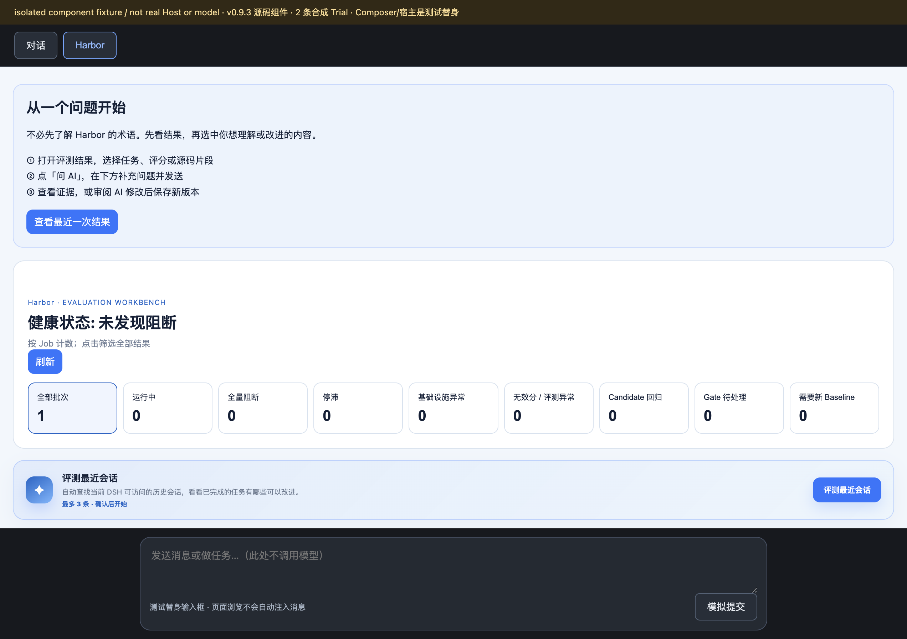
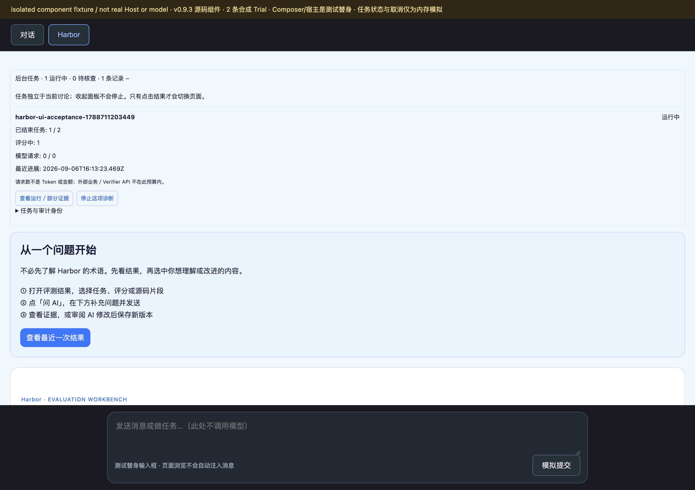
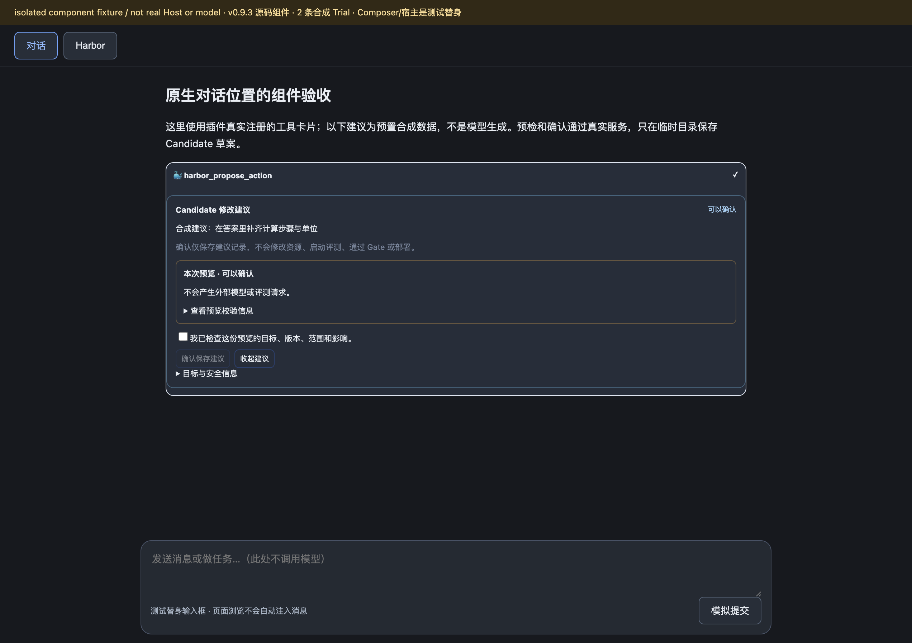
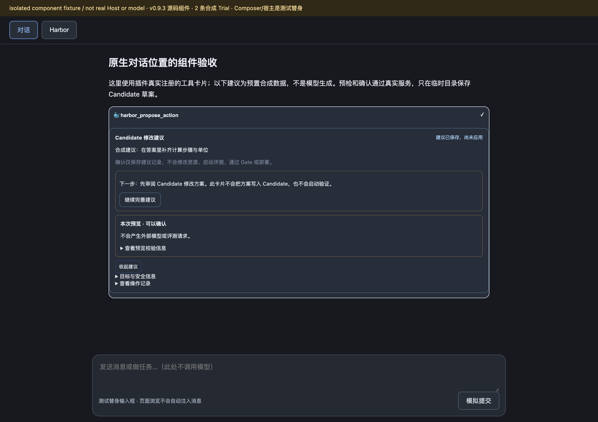
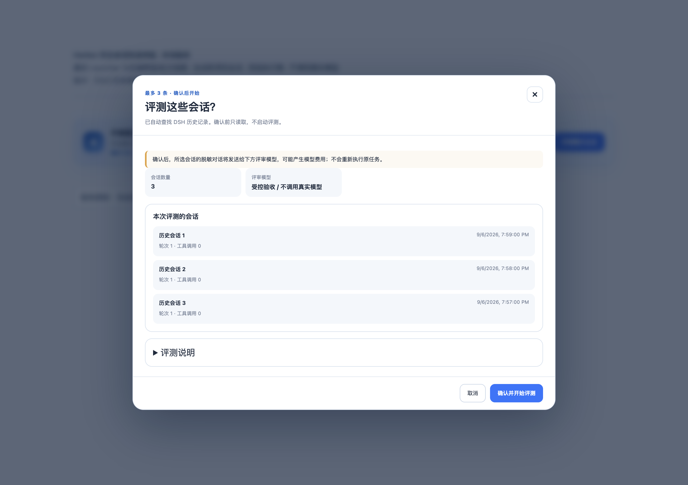
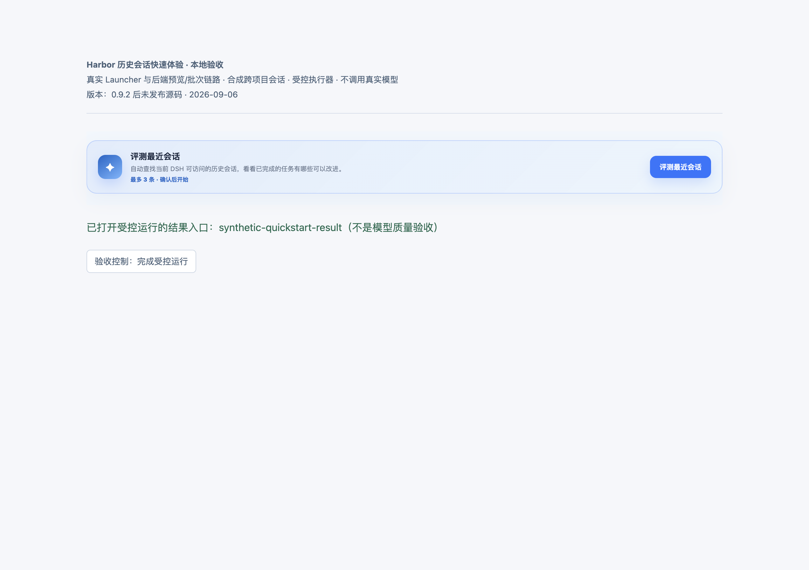
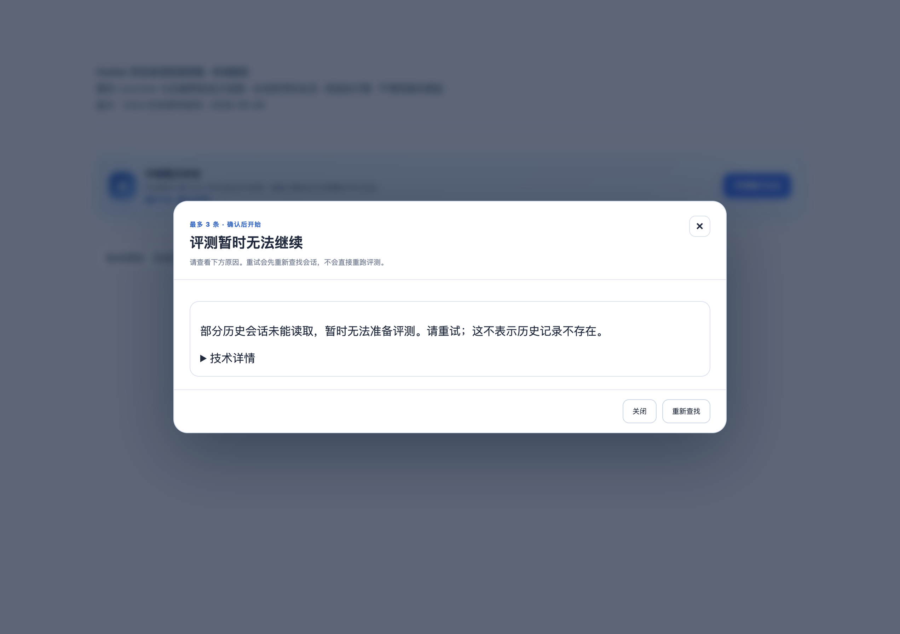

# Harbor 0.9.3：变更与验证过程图

- 归档日期：2026-09-07（Asia/Shanghai）。npm/PyPI 发布、公开 registry 独立核对、Release 软件包与验证资料包核对均已完成。不代表用户已安装版本已更新。
- 产品版本 / tag：`0.9.3` / `v0.9.3`；产品提交为 [`1a04185f37ecb2d1b63f1e3769dd7505cb239e89`](https://github.com/istarwyh/harbor-self-evolving/commit/1a04185f37ecb2d1b63f1e3769dd7505cb239e89)，来自已合并的 [PR #27](https://github.com/istarwyh/harbor-self-evolving/pull/27)。
- 包发布状态：npm 与 PyPI 工作流均成功；公开 registry 独立下载的三个软件包、同次 CI 制品及 [GitHub Release](https://github.com/istarwyh/harbor-self-evolving/releases/tag/v0.9.3) 附件逐一比对一致，并与本地 preflight 包的散列相同。
- 资料归档状态：8 张截图、浏览器操作、本地验证与发布工作流来源已归档；验证资料 ZIP 已上传，重新下载后与本地逐字节一致，说明中的 8 张相对路径图片均存在且匹配原图。

## 这次改了什么

| 改动 | 用户可见的变化或解决的问题 | 验证资料 |
| --- | --- | --- |
| 原生对话精简 | 移除 Context Capsule 和重复的 Harbor Copilot 可见面板，工作台恢复单列；成功读取且没有任务时隐藏任务区域 | 图 01；相关组件回归已包含于本次 549 项全量测试 |
| 任务回到 Harbor 主页面 | 默认折叠，仍可取消、检查异常、恢复确认及查看结果 | 图 02；取消/精确结果导航 DOM 核查与全量回归 |
| 原生工具卡审阅 AI 建议 | 先预览、再人工确认；保存建议明确不是应用 Candidate 修改 | 图 03–04；真实服务预览与草案保存 |
| 历史会话直接体验 | Web 入口自动寻找最多 3 条合格历史，不要求用户选择源目录、项目或日期；确认前不开始评测 | 历史图 05–06；本次 549 项全量回归 |
| 关闭弹窗后仍能交付结果入口 | 保留后台完成回调，并修复延迟 reload 下的结果导航 | 历史图 07 仅展示旧完成回调；本次启动器 22 项回归包含延迟 reload 修复 |
| 读取失败不等于没有历史 | 明确原因与重试入口，技术信息默认折叠 | 历史图 08；错误与空态回归已包含于全量测试 |
| Agent 与 Web 的选择范围分离 | 公开 Agent preview 固定 `exact-cwd`；跨项目 `dsh-history` 仅作为内部 Web option，不能通过工具参数扩大范围 | 非 UI 变更；范围与 token 回归已包含于全量测试 |

## 环境与证据身份

图 01–04：2026-09-07 约 00:14–00:17 +08:00，对包版本字段已为 `0.9.3`、当时尚未提交的源码重新操作与截图。其产品源码随后纳入 `1a04185f37ecb2d1b63f1e3769dd7505cb239e89`；已逐字节核对，该产品源码 tree 与本地检验/截图使用的源码一致。发布后补录本说明不改变截图日期，也不把后续文档提交作为截图时的运行版本。macOS、Chrome，视口 1272 × 898 CSS px，PNG 2544 × 1796 px。原生预览加载真实插件 React 组件、slot 注册与 HTTP / `EvolutionService` 链；宿主标签、Composer、任务进度与取消均为测试替身。临时工作空间含 2 条合成 Trial，Job 为 `harbor-ui-acceptance-1788711203449`。预置建议不是模型生成，建议确认仅向临时工作空间保存草案，不修改 Candidate。

图 05–08：来自 2026-09-06（Asia/Shanghai）的历史验收原图，源码身份是 `75bb114f812b3660c510e054419c248c1b81d8b8` 加当时未提交修改，**包版本字段仍为 `0.9.2`，不是新发布的 0.9.3 实拍**。macOS、Node `22.22.2`、Python `3.12.14`、Chrome、React / ReactDOM `18.3.1`；原图尺寸 2544 × 1796 px。真实 `HistoricalLauncher`、HTTP handler、`HistoricalWebController`、`SessionDiagnosticService`、选择器与批次物化链参与运行；DSH Session Query、评审模型绑定和最终运行器为测试替身，技术错误组件在隔离页面使用简化替身。

历史样本为来自 4 个源项目的 4 条合成会话，输出目录是没有自身历史的独立临时目录。没有读取用户真实历史、改变 DSH profile、重启用户服务、调用真实模型 / Host Broker / Harbor CLI / Docker 或产生模型费用。`synthetic + component/service + controlled-runner` 是这些历史图的证据类型，**不是 real-provider 或真实 Host 端到端验收**。

全部 8 张图已逐张检查可读性与敏感信息，只有合成标识，不含凭据或业务私有内容。历史 4 张为逐字节归档，原图与副本的 SHA256 分别一致；新 4 张由本次浏览器直接捕获，未修图、补画或遮盖失败提示。静态截图只记录可见状态，过程断言、身份检查与竞态修复由 DOM、真实服务及回归测试补证。

## 01 · 无任务时不占用工作台空间

- 来源与时间：本次 0.9.3 源码预览，2026-09-07 约 00:14–00:17 +08:00；采集时尚未提交，已确认其产品源码与随后发布的 `1a04185` 一致，环境与尺寸见上文。
- 证据类型：`synthetic + component/service`；宿主标签和 Composer 为测试替身，不调用真实模型。
- 操作过程：打开 `?scene=empty`，等待任务读取完成。
- 预期：工作台单列；旧 Context / Copilot 可见面板不存在；空任务区域完全隐藏，不改变输入草稿。
- 实际结果：本次 DOM 核查中旧 Context / Copilot 两类面板数量均为 0，任务区域数量为 0；工作台保持单列，Composer 为空。
- 边界：真实插件组件的隔离预览，不是已安装 DSH Host 的页面或普通消息自动上下文验收。

## 02 · 任务控制保留在插件页面内

- 来源、时间、环境与证据类型：同图 01，属于本次 00:14–00:17 +08:00 操作过程。
- 操作过程：打开 `?scene=tasks`，展开任务入口，检查取消和结果导航。
- 预期：入口默认折叠，展开后有查看运行/部分证据与停止入口；取消不发送对话，导航指向准确 Job。
- 实际结果：展开入口时显示 active 合成任务及控制按钮；点击取消后 DOM 显示“已取消”。再点击显式结果按钮，导航指向 `harbor-ui-acceptance-1788711203449`，Composer 保持空白。截图记录取消前的控制入口，取消与导航后的结果由本次 DOM 核查补证。
- 边界：任务进度与取消为内存模拟，不证明真实评测进程或 Docker 取消/恢复成功。

## 03 · 原生工具结果卡先预览、后确认

- 来源、时间、环境与证据类型：同图 01，属于本次 00:14–00:17 +08:00 操作过程。
- 操作过程：打开 `?scene=proposal`，点击“检查并预览”，在未勾选审阅框时检查确认按钮。
- 预期：真实服务返回可审阅预览；未确认审阅时不能保存；没有第二个 Copilot 可见面板。
- 实际结果：点击检查后真实服务返回预览；审阅框未勾选时确认保存按钮为 disabled。本次截图记录预览状态，没有第二个 Copilot 可见面板。
- 边界：预置合成建议不是 Host 模型产生；组件与服务返回不证明真实宿主的完整模型工具调用旅程。

## 04 · 保存建议不冒充已经应用

- 来源、时间、环境与证据类型：同图 01，属于本次 00:14–00:17 +08:00 操作过程。
- 操作过程：在图 03 预览后勾选审阅框，确认保存建议。
- 预期：卡片显示“建议已保存，尚未应用”，提供继续完善入口；服务记录 `applied: false`。
- 实际结果：勾选审阅框并确认后，真实服务在临时工作空间保存建议草案；DOM 显示“建议已保存，尚未应用”，截图记录保存后的明确提示，没有把它写成已经修改 Candidate 或执行评测。
- 边界：只保存临时工作空间的 Candidate 建议，不修改 Candidate，不启动模型、评测、Gate、部署或发布。

## 05 · 自动预览最多三条历史会话

来源：2026-09-06（Asia/Shanghai）历史原图 `historical-quickstart/screenshots/01-auto-preview.png`；版本/环境和 `synthetic + component/service + controlled-runner` 身份见上文。原图逐字节复制为图 05。

过程与结果：点击“评测最近会话”，预览可见 3 条合成会话、受控评审模型、费用与确认说明；没有源目录、项目或日期控件。原记录中的 DOM/服务核查为 1 次预览、4 次历史读取、0 次运行、0 次批次物化，集成测试另检查确认前不创建 `.harbor`。**计数不是截图直接显示的内容，也不是本次重新运行的结果。**

边界：选择器按最新创建的候选分批读取，够用即停止且保留读取预算，再对入选样本按最后活动时间排序；不宣称已遍历全历史并找出按活动时间最新的 3 条。当前/子会话、未完成或中止、缺少直接用户输入或助手回答、Harbor 内部会话仍被排除。此图不替代本次公开 Agent `exact-cwd` 固定范围的回归。

## 06 · 明确确认后才进入后台运行

来源：2026-09-06（Asia/Shanghai）历史原图 `historical-quickstart/screenshots/02-background-running.png`；版本/环境与证据类型同图 05。

过程与结果：点击“确认并开始评测”，实际组件显示 3 条会话的后台运行状态，可以关闭窗口继续工作。历史记录中的计数变为 1 次运行、7 次历史读取、1 次物化；新增读取用于重验所选源会话。受控运行器检查批次为 `dsh-history` 且有 3 条记录后保持等待。

边界：真实服务与批次链参与，最终运行器受控；没有实际 Harbor/Docker 或模型评审。截图展示运行中，不是已经完成或业务分数有效。

## 07 · 关闭窗口后收到受控完成通知

来源：2026-09-06（Asia/Shanghai）历史原图 `historical-quickstart/screenshots/03-result-entry.png`；版本/环境与证据类型同图 05。图中明确保留“0.9.2 后未发布源码”日期标记。

过程与结果：关闭运行窗口，通过验收控制结束受控运行；实际轮询收到完成状态并调用结果回调，窗口保持关闭。绿色文字记录回调参数 `synthetic-quickstart-result`。

边界：**绿色文字是测试页记录的结果入口参数，不是实际 Job 结果页或模型质量验收。此旧图也不证明 0.9.3 收尾的延迟 reload 导航修复。** 后者已由本次 `historical-launcher` 22/22 定向回归（含延迟 reload 场景）验证，不能用旧完成回调截图代替。

## 08 · 读取失败不误报为没有历史

来源：2026-09-06（Asia/Shanghai）历史原图 `historical-quickstart/screenshots/05-read-failure.png`；版本/环境与证据类型同图 05，原图是在最终错误提示补齐并重建隔离页面后采集。

过程与结果：模拟历史正文读取失败，页面说明“这不表示历史记录不存在”，提供“重新查找”，技术详情默认折叠；没有触发运行。历史页面进程累计 2 次预览、4 次读取、0 次运行、0 次物化。原验收还单独覆盖空历史分支，本图不是空历史状态。

边界：失败来自 Session Query 测试替身，不是用户真实数据故障；简化错误组件只用于隔离页面，真实嵌套位置靠自动化测试补证。

## 测试与发布核对

本地检验源码与发布提交 `1a04185` 的产品源码逐字节一致。[PR CI 34045298656](https://github.com/istarwyh/harbor-self-evolving/actions/runs/34045298656)、[main CI 34045348834](https://github.com/istarwyh/harbor-self-evolving/actions/runs/34045348834)、[tag CI 34045411874](https://github.com/istarwyh/harbor-self-evolving/actions/runs/34045411874) 均成功。

本次统一版本的最终本地结果为 **549/549 Node 测试通过（0 失败、0 跳过），318/318 Python 测试通过**；其中 Historical 启动器定向回归为 **22/22**，包括延迟 reload 导航。其它定向测试文件的结果已包含在 549 项全量运行中，不另行编造本次独立执行数量。

此前原生改动曾有 487/487、共享整合前 532/533（1 项失败），后续有 542/542 Node 与 318/318 Python 的历史整合记录；原验收文档保留这些旧结果，不能与本次收尾修复后的结果混淆。

| 项目 | 命令或来源 | 本次实际结果与边界 |
| --- | --- | --- |
| 客户端构建与全量 Node 回归 | `packages/dsh-plugin` 中执行 `npm run check` | 549/549 通过，0 失败、0 跳过；已匹配发布源码 `1a04185` |
| 原生组件、工具卡与任务区 | 定向复现：`node --test test/native-tool-render.test.js test/operation-tray.test.js test/documentation.test.js` | 本次结果已包含于全量 549 项；不代替真实 Host 验收 |
| Historical 范围、服务与批次链 | 定向复现：`node --test test/session-selection.test.js test/session-diagnostic.test.js test/historical-web.test.js test/historical-quickstart.test.js` | 已包含于全量 549 项；公开 preview 固定 `exact-cwd`，只有 Web 内部可跨项目 |
| Historical 完成与延迟 reload | `node --test test/historical-launcher.test.js` | 22/22 通过；旧图 07 不证明该修复 |
| Python Adapter 与 schema | Python 包中执行 `uv sync --frozen`、`uv run --frozen pytest` | 318/318 通过；包括旧 v1 `exact-cwd` 批次兼容 |
| 当前原生组件与服务旅程 | 本次浏览器图 01–04、DOM 检查和真实 HTTP / Service 操作 | 空态、任务控制、预览审阅和草案保存符合预期；宿主与任务执行仍为测试替身 |
| 锁定依赖与本地制品 | `npm ci`、`npm pack`、`uv build` | npm 当次报告 0 个漏洞，打包 50 个文件；Python wheel/sdist 构建成功；不等于公开发布已完成 |
| 同步与可重复构建 | schema `cmp`、shell 语法、`git diff --check`、客户端重新构建 | 均通过；重建客户端 SHA256 与打包前一致，见下文 |
| npm 包与对应发布运行 | [npm 34045411919](https://github.com/istarwyh/harbor-self-evolving/actions/runs/34045411919)，`v0.9.3` / `1a04185` | 工作流成功；公开 tarball 的 50 个文件匹配 tag，SHA1/SHA512 正确；与同次 CI、Release、本地包散列一致 |
| PyPI wheel/sdist 与对应发布运行 | [PyPI 34045411860](https://github.com/istarwyh/harbor-self-evolving/actions/runs/34045411860)，`v0.9.3` / `1a04185` | 工作流成功；公开 wheel/sdist 下载与同次 CI、Release、本地包散列一致；38/71 个源码文件匹配 tag，公开 wheel 三入口及 16 项 loader smoke 通过 |
| GitHub Release 与附件 | [Harbor 0.9.3](https://github.com/istarwyh/harbor-self-evolving/releases/tag/v0.9.3) | 三个软件包及图集资料 ZIP 下载比对通过；附有 SHA256SUMS，ZIP 内说明与 8 张图片完整 |

客户端 `packages/dsh-plugin/lib/client.js` 的本次重建 SHA256：`a4ffdec4d7044c8d4720b5dcfbae456d4bc17e9e44ac265398843fe538ff05ba`。这是客户端文件的一致性记录，不是 npm/PyPI 制品自身的散列。

本地制品 preflight：npm 包的 50 个文件已逐字节与预期内容匹配；wheel 共 43 个文件，其中 38 个源码文件匹配；sdist 共 73 个文件，对应源码匹配。在新的临时目录从 wheel 导入实际版本 `0.9.3`，3 个入口均可加载；合成 v1 `exact-cwd` / `dsh-history` loader 定向 smoke 为 **16 项通过、23 项 deselected**。23 项未被该定向命令选中，不是全量测试出现 23 项跳过。制品不含真实凭据；sdist 包含刻意构造的假凭据脱敏测试样例，wheel 不包含这些测试样例。

| 已比对的本地 / 同次 CI / 公开 registry / Release 制品 | SHA256 |
| --- | --- |
| npm tarball | `b1eae6aa80f4471921096e507d99db73dadb41d9a96026979f05a861f7db44f6` |
| Python wheel | `ff0eb05021ec9e804dda4b21fb491f5390db2f8340cb3ed5e0bcfa8bf0125d42` |
| Python sdist | `d53fdeaaf3b480cbcd22fc6f1c8e339be07289a97d11e9ace5d85d0627dda19f` |

以上散列最初来自本地 preflight；发布后已实际下载对应 npm/PyPI 工作流产物、Release 的三个软件包以及公开 registry 文件，逐个比较后确认均与上表一致，**不是假定 CI 重建必然逐字节相同**。

公开包来源：[npm 0.9.3 tarball](https://registry.npmjs.org/dsh-harbor-evolution/-/dsh-harbor-evolution-0.9.3.tgz)、[PyPI 0.9.3](https://pypi.org/project/harbor-dsh-evolution/0.9.3/)。npm 包的 50 个文件匹配 tag，声明的 SHA1/SHA512 校验正确；PyPI wheel 的 38 个源码文件与 sdist 的 71 个源码文件匹配 tag。公开 wheel 在独立临时目录导入成功，3 个入口均可加载，16 项合成 loader 测试通过；这仍不是实际 Host 或真实模型质量验收。

默认版本传播：首次读取 PyPI 未指定版本的项目 JSON 时仍返回 `0.9.2`，明确版本 `0.9.3` 的文件已可下载；随后复查，npm `/latest` 与 PyPI 默认 JSON 均已返回 `0.9.3`，PyPI simple index 的两个文件摘要匹配且均未撤回。没有把首次的索引延迟误报为缺包，也没有只凭工作流成功结束验证。

[npm provenance](https://registry.npmjs.org/-/npm/v1/attestations/dsh-harbor-evolution@0.9.3) 已独立完成 Sigstore 密码学验签，限定 GitHub issuer 与 `publish-npm.yml@refs/tags/v0.9.3` 身份，subject、产品提交、发布 run 与 Rekor 条目 `2741291796` 均匹配。PyPI 证明仅核对了身份和摘要对应关系，**未独立做密码学验签，不宣称完整 SLSA 验证**。

保留的非阻塞提醒：[Python 发布运行 34045411860](https://github.com/istarwyh/harbor-self-evolving/actions/runs/34045411860) 的实际测试日志为 **318 passed、18 warnings**。提醒来自 Harbor 上游 `config.py` 对 `/logs/artifacts` 与 `/logs/artifacts/session-observation.json` 的重叠收集，冲突时保留第一项；测试与发布成功不等于没有警告。

原始验收账本：[原生对话精简](https://github.com/istarwyh/harbor-self-evolving/blob/1a04185f37ecb2d1b63f1e3769dd7505cb239e89/docs/verification/native-conversation/README.md)、[历史会话快速体验](https://github.com/istarwyh/harbor-self-evolving/blob/1a04185f37ecb2d1b63f1e3769dd7505cb239e89/docs/verification/historical-quickstart/README.md)。链接固定在产品提交；原始日期、环境、曾失败的结果和范围均保留，不把早期记录改写成本次实测。

## 未完成项与验证边界

- 普通消息的自动页面上下文尚未实现。已检查的本机 DSH rc.8 公开 `IConversation`、`SessionInput` 和 input-trigger 合约没有通用的发送前原子挂载入口；本次未使用私有 Host 状态、发送后注入或自动插入引用模拟该能力。可选 Ask AI / `@harbor` 仍需用户明确操作，浏览页面不会自动发送或改写草稿。
- 原生工具卡的导航提示是打开 Harbor 标签，不宣称可自动切换真实宿主标签。新旧隔离预览的宿主标签和 Composer 均为测试替身。
- 未进行真实 Host 安装/刷新、真实 Session Query 历史读取、真实模型与 Candidate 质量评测、Host Broker/Harbor CLI/Docker 完整执行、真实取消恢复、完整键盘/屏幕尺寸矩阵或原有 100-Trial 实机验收。本次组件/服务证据不等于正式安装包端到端验收。
- 源码修复、单项测试通过、截图可见与包发布是不同事实；本版不能据此宣称完整 PRD 或新的业务基线通过。本地测试、发布工作流、公开 registry、Release 软件包和验证资料包均已分别核对。
- 历史原生预览曾遇本机 ReactDOM 19 / React 18 不匹配，改用既有 18.3.1 配对依赖，并在预览脚本建立临时目录或监听之前检查主版本。此记录是验收环境修正，不是产品运行故障已通过截图解决。

## 发布入口与资料包

- 版本发布页：[Harbor 0.9.3](https://github.com/istarwyh/harbor-self-evolving/releases/tag/v0.9.3)。
- 相关实现：[PR #27](https://github.com/istarwyh/harbor-self-evolving/pull/27)、[产品提交 `1a04185`](https://github.com/istarwyh/harbor-self-evolving/commit/1a04185f37ecb2d1b63f1e3769dd7505cb239e89)；完整原始验收记录见上方固定提交链接。
- 验证资料包：[harbor-0.9.3-verification.zip](https://github.com/istarwyh/harbor-self-evolving/releases/download/v0.9.3/harbor-0.9.3-verification.zip)，含本说明与 8 张图，上传后已重新下载核对。
- 下载校验：[SHA256SUMS](https://github.com/istarwyh/harbor-self-evolving/releases/download/v0.9.3/SHA256SUMS)，包含三个软件包与验证资料 ZIP 的 SHA256。

资料包包含 `v0.9.3/README.md` 与引用的 `v0.9.3/screenshots/` 图片，解压后可离线看图；源码、日志与发布来源使用在线链接。归档提交完成后，在 Release 与当次交付说明中放上指向该提交的图集永久链接，本说明无需自链。补录资料不移动已公开 tag、不覆盖安装包、不重发同版本，也不增加发布校验脚本、CI 门禁或审批。
