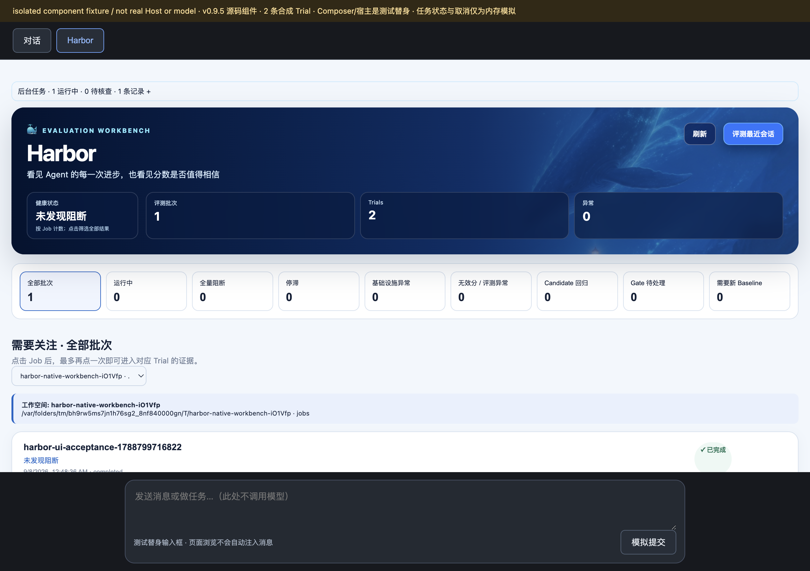
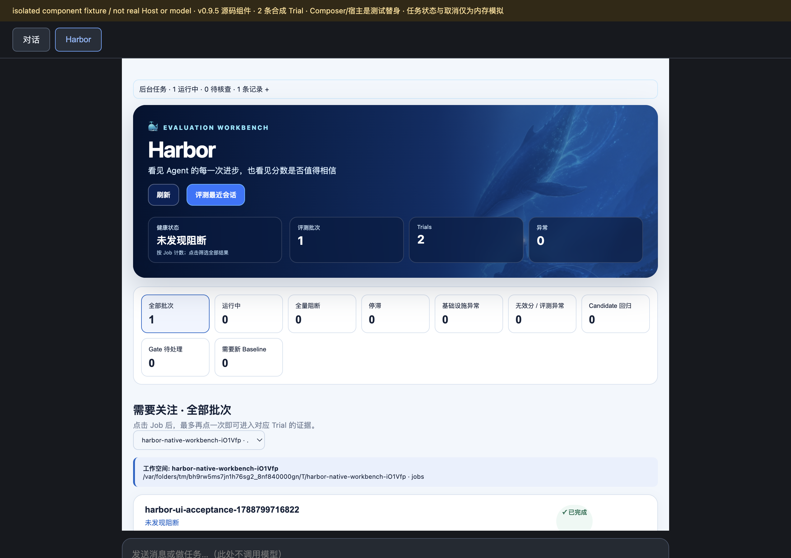
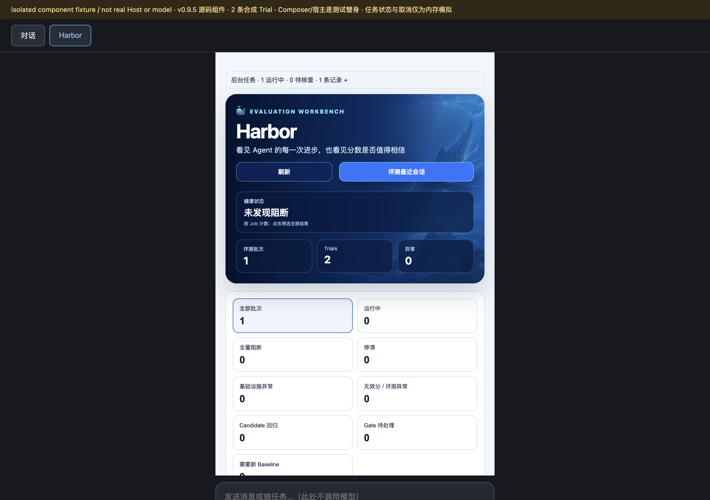

# Harbor 0.9.5：紧凑首页与历史会话数据边界

- 归档日期（含时区）：2026-09-08，Asia/Shanghai（UTC+08:00）。
- 目标发布版本 / tag：`0.9.5` / `v0.9.5`。
- 被验证的产品版本 / 提交：发布候选基于 `b748d49a94689bbcfa4a68cf39b696dc09f9b05d`；正式 `v0.9.5` tag 指向产品提交 `97d01bf3ee9abaed9f2555135def7ab55d2b722d`。本发布后记录位于 tag 之后的文档提交，不移动产品 tag。
- 验收环境：macOS arm64、Node 22.22.2；隔离发布工作树中的真实插件源码、真实浏览器 bundle 与本地组件/服务 fixture。
- 数据与模型：synthetic component fixture；2 条合成 Trial；未调用模型、真实提供方、Candidate 或 Docker。
- 包发布状态：npm 0.9.5 与 PyPI 0.9.5 已公开且默认版本均为 0.9.5；GitHub Release 使用正式 tag，并在本归档提交后附加资料 ZIP 与校验清单。
- 资料归档状态：3 张本次源码组件截图、机器记录、本地/公开包验证均已归档；资料 ZIP 从本次发布后归档提交生成，公开下载状态以 Release 页面为准。

## 这次改了什么

| 改动 | 用户可见的变化或解决的问题 | 验证资料 |
| --- | --- | --- |
| 紧凑 Harbor Hero | 首页把 Harbor 身份、健康状态、Job/Trial/异常指标、刷新与“评测最近会话”统一到一个深蓝 Hero；移除重复的新手引导与独立健康卡 | 场景 01–03；Node 客户端回归测试 |
| 强制页面上下文 | 兼容 Host 上从 Harbor 页面普通发送时始终冻结当前对象/选择，不再提供容易静默丢上下文的开关；显式引用仍优先 | `automatic-page-context`、`client` 回归测试 |
| 历史会话数据策略 | 普通 Unix/macOS/Windows/UNC 路径保留，凭据与原始 Session id 继续脱敏并 fail closed；确认前展示数据策略与 Judge 输入边界 | `session-diagnostic`、`session-redaction`、`historical-launcher` 回归测试 |

## 01 · 桌面宽度下的统一首页

- 截图/验证日期（含时区）：2026-09-08 00:48，UTC+08:00。
- 版本/提交与环境：0.9.5 源码候选，基于 `b748d49`；真实浏览器 bundle，1272 CSS px 视口。
- 来源与证据类型：本次实测；synthetic component fixture；无模型调用。
- 操作过程：启动隔离 fixture → 打开 Harbor Tab 的合成任务场景 → 检查 DOM 与整页渲染。
- 预期结果：只出现一个紧凑 Hero，包含刷新、历史会话启动、健康和三个总览指标；下方保留完整关注筛选。
- 实际结果：Hero、操作按钮、健康、1 个 Job、2 个 Trial、0 个异常和全部筛选均可见；DOM 中不存在 Getting Started 区块或自动上下文复选框。
- 截图与补充证据：[桌面首页](screenshots/01-synthetic-home-desktop.png)；机器记录见 [acceptance.json](acceptance.json)。
- 验证边界：组件/服务 fixture，不是已安装 Host、真实模型或真实评测运行。
- 脱敏说明：仅包含临时 fixture 路径与合成 Job；无凭据、个人信息或业务数据。

## 02 · 880 px 容器响应式布局

- 截图/验证日期（含时区）：2026-09-08 00:49，UTC+08:00。
- 版本/提交与环境：同场景 01；把 Harbor 容器限制为 880 CSS px。
- 来源与证据类型：本次实测；synthetic component fixture；无模型调用。
- 操作过程：在同一真实 bundle 中设置 880 px 容器 → 读取容器 `clientWidth` / `scrollWidth` → 截图。
- 预期结果：操作按钮换行，Hero 与筛选不产生水平溢出。
- 实际结果：Harbor 根容器 `clientWidth=880`、`scrollWidth=880`，Hero 宽 844；内容完整可读。
- 截图与补充证据：[880 px 首页](screenshots/02-synthetic-home-880px.png)；机器记录见 [acceptance.json](acceptance.json)。
- 验证边界：容器宽度验证，不等同于完整设备/浏览器矩阵。
- 脱敏说明：同场景 01。

## 03 · 500 px 容器窄屏布局

- 截图/验证日期（含时区）：2026-09-08 00:50，UTC+08:00。
- 版本/提交与环境：同场景 01；把 Harbor 容器限制为 500 CSS px。
- 来源与证据类型：本次实测；synthetic component fixture；无模型调用。
- 操作过程：在同一真实 bundle 中设置 500 px 容器 → 检查操作、健康与指标重排 → 读取溢出状态 → 截图。
- 预期结果：按钮、健康与指标按窄屏规则重排，无水平溢出或隐藏的旧控制。
- 实际结果：根容器 `clientWidth=500`、`scrollWidth=500`，Hero 宽 464；两个操作按钮、单列健康、三列指标与双列筛选均完整，旧复选框和 Getting Started 均不存在。
- 截图与补充证据：[500 px 首页](screenshots/03-synthetic-home-500px.png)；机器记录见 [acceptance.json](acceptance.json)。
- 验证边界：容器级响应式证据，不证明触屏、键盘、读屏或所有真实移动浏览器。
- 脱敏说明：同场景 01。

## 测试与发布核对

| 项目 | 版本/提交、命令或来源链接 | 实际结果与边界 |
| --- | --- | --- |
| 与本次改动相关的测试/验收 | `./hse test`、[本地验证摘要](evidence/local-validation.txt) 与 `acceptance.json` | Python 318/318、Node 591/591 通过；npm 52/52、wheel 38/38、sdist 72/72 非生成文件与源码逐字节一致；截图只证明源码组件的可见布局与 DOM 状态 |
| npm 包与对应发布运行 | [OIDC run 34146528116](https://github.com/istarwyh/harbor-self-evolving/actions/runs/34146528116) | 成功；公开 tgz 与本地候选、工作流制品相同，latest=0.9.5，隔离安装/入口和 npm attestation 验证通过 |
| PyPI wheel / sdist 与对应发布运行 | [run 34146528050](https://github.com/istarwyh/harbor-self-evolving/actions/runs/34146528050) | 成功；两个公开文件与候选、工作流制品相同，默认版本=0.9.5，导入、3 个 entrypoints、2 个插件通过 |
| GitHub Release 与附件 | [v0.9.5](https://github.com/istarwyh/harbor-self-evolving/releases/tag/v0.9.5) | 正式 tag 与三份包制品已核对；资料 ZIP、校验清单和最终公开下载状态以 Release 页面为准 |

发布分支、PR、主线与 tag CI 均成功：[分支 CI](https://github.com/istarwyh/harbor-self-evolving/actions/runs/34146403263)、[PR CI](https://github.com/istarwyh/harbor-self-evolving/actions/runs/34146406014)、[主线 CI](https://github.com/istarwyh/harbor-self-evolving/actions/runs/34146460522)、[tag CI](https://github.com/istarwyh/harbor-self-evolving/actions/runs/34146528064)。公开制品摘要、来源、安装烟测与 provenance 边界见[公开验证记录](evidence/public-packages.txt)。npm 执行了签名/attestation 验证；PyPI 核对了发布身份、来源字段、摘要与证书字段一致性，但没有执行独立密码学签名或证书链验证。

## 未完成项与验证边界

- 未执行真实提供方、Candidate/Docker 评测、业务质量基线、完整 Host 安装升级、触屏/键盘/读屏或完整浏览器矩阵。
- 历史会话数据策略由单元/集成回归测试覆盖；本轮没有把真实会话正文或凭据发送给 Judge，也没有为了截图启动评测。
- 组件截图、测试通过、包发布与业务质量是不同证据，不能互相替代。

## 发布入口与资料包

- 版本发布页：[Harbor v0.9.5](https://github.com/istarwyh/harbor-self-evolving/releases/tag/v0.9.5)。
- 完整验收记录 / 相关提交或 PR：功能 PR [#34](https://github.com/istarwyh/harbor-self-evolving/pull/34)；发布 PR [#35](https://github.com/istarwyh/harbor-self-evolving/pull/35)；产品提交 [`97d01bf`](https://github.com/istarwyh/harbor-self-evolving/commit/97d01bf3ee9abaed9f2555135def7ab55d2b722d)。
- 验证资料包：[harbor-0.9.5-verification.zip](https://github.com/istarwyh/harbor-self-evolving/releases/download/v0.9.5/harbor-0.9.5-verification.zip)，从本次发布后归档提交生成；公开下载与校验结果以 Release 页面为准。

公开 npm/PyPI 包、工作流制品与本地候选的三组摘要完全一致。资料包生成后还需独立下载、解压并核对相对图片链接；该结果记录在 Release，不移动公开 tag，不覆盖同版本包。
