# 基于已有生成记录的 Harbor 冷启动技术方案（DSH 会话历史）

> 状态：实施中（源码与自动化契约已落地；合成链路及真实 Session Query + 当前 Host Judge 的 Docker/Harbor 后端 E2E 已通过；真实 DSH Web 与浏览器 Workbench 手动旅程待验收）
>
> 日期：2026-08-30
>
> 目标版本：当前开发迭代（发布版本与完整用户旅程结论待最终验收）
>
> 能力定义：Harbor 新增一等能力 **Historical Generation Evaluation**，用于评测已有生成器已经产生的不可变 Generation Records。
>
> 默认映射：**1 个 Harbor 历史生成结果评测 Job = 最近 10 条合格 DSH 会话；每条会话 = 1 个 Trial。**

## 1. 决策摘要

本方案把 DeepSeek Harness（DSH）已经完成的真实会话作为 Harbor 冷启动阶段的默认评测证据源。它的核心改造不是增加一个 Session Adapter 特例，而是补齐 Harbor 对**已有生成结果**的一等评测能力。

生成器仍然是产生会话的 DSH Agent。历史会话不是再次提供给生成器的 prompt 语料，而是生成器已经产生的真实任务、回答、工具调用、执行结果和用户反馈证据。

Harbor 由此明确支持两种相互独立的生成来源：

| 模式 | 生成结果从哪里来 | Trial 做什么 |
| --- | --- | --- |
| Candidate Execution Evaluation | Harbor 在固定 Task Environment 中现场执行 Candidate | 评测这次新执行产生的结果 |
| Historical Generation Evaluation | 从外部系统读取生成器过去已经产生的 Generation Record | 评测冻结后的已有结果，不重新执行生成器 |

两种模式复用 Dataset、Evaluator、Artifact 和 Population 基础设施，但不能共享虚假的 Candidate 身份或执行语义。DSH Session 是 Historical Generation Evaluation 的第一个 `source_kind`，未来可以扩展到生产轨迹、导入的 Agent Run、人工会话和其他 Harness 的历史记录。

本方案中的跨 Trial 汇总统一称为 **Population Analysis / Generator Diagnosis**：它根据十条生成记录寻找 DSH Agent 的重复失败模式。它不是“元评测”。严格的 **Evaluator Meta-Evaluation** 专指用独立 Ground Truth 评估 Evaluator/Evaluation Stack 本身是否可靠。现有 `harbor_ground_truth_init` + `harbor_evaluator_meta_evaluate` 已提供独立的 GT/Observation/Report 流程；Historical Generation Job 内不自动执行该流程，必须写出 `status=not-run`。未来工作是把现有元评测能力进一步 Job 化，而不是把元评测能力从零实现。

冷启动链路采用以下语义：

```text
DSH Agent 已完成的会话
→ 选择当前工作区最近 10 条合格会话
→ 冻结、投影和脱敏为不可变 Generation Record Batch（DSH Session Source）
→ 物化为 1 个 Harbor Dataset（10 个 Tasks）
→ 运行 1 个 historical-generation-evaluation Job（source_kind=dsh-session，10 个 Trials）
→ Evaluator 逐 Trial 评分或明确弃权
→ Population Analysis / Generator Diagnoser 汇总跨 Trial 模式
→ Optimizer 基于生成器诊断提出 1 个受控改进建议
→ 经用户确认后，把高价值 Badcase 转成固定回归任务
→ 使用真实 Candidate 运行普通 Harbor Job 和 Promotion Gate
```

本方案作出九项关键决策：

1. **已有生成结果是独立 Evaluation Target。** `execution_mode=observe-existing` 与现场执行 Candidate 的 `execute-candidate` 明确分离。
2. **DSH Session 是 Generation Record 和行为证据，不是 Candidate 输入。** 冷启动评测不得把历史回答重新注入生成器。
3. **一个 Session Batch 对应一个 Job；一条 Session 对应一个 Trial。** 不为十条会话创建十个孤立 Job。
4. **新增独立 Job 类型 `historical-generation-evaluation`。** 它评测历史记录，不把 Observation Adapter 冒充原 Generator 或 Candidate。
5. **只评测冻结后的脱敏快照。** 原始 Session Log 留在 DSH Session Store，不复制进项目、容器和 Job。
6. **历史结果评测要求 Evaluator 支持“证据不足/不适用”。** 不允许为了满足三元分数而虚构判断。
7. **跨 Trial 汇总叫 Generator Diagnosis，不叫 Evaluator Meta-Evaluation。** 前者分析生成器，后者验证评测器可靠性。
8. **Optimizer 不影响 reward，也不自动修改 Generator/Candidate。** 它必须引用 Job/Trial evidence，并只提出一个下一实验。
9. **Promotion Gate 对历史生成结果评测 Job 永久拒绝。** 滚动的最近十条会话只能用于诊断和发现 Badcase，不能证明 Candidate 晋级。

## 2. 背景、设计起点与当前状态

### 2.1 当前系统已经具备的能力

DSH 当前提供正式的 Session Query 能力：

- `ctx.sessionQuery.listSessions()`：列出 live-preferred 的逻辑会话集合；
- `ctx.sessionQuery.readSession(sessionId)`：读取完整、校验后的事件日志快照；
- `ctx.sessionQuery.readSurface(sessionId)`：读取当前模型可见 Surface；
- `ctx.sessionQuery.readTitleSnapshots()`：批量读取标题；
- `ctx.messageFeedback.list()`：可选读取用户对最终 Assistant Message 的正负反馈和备注；
- `ctx.sessionProjectionCache`：可选为冷会话提供持久化投影缓存。

DSH Web 默认组合已经挂载 Session Persistence、Session Query、Session Projection Cache 和 Message Feedback。Harbor 插件应通过这些正式 Service 读取数据，**不得直接扫描或解析 `~/.dsh/sessions`**。持久化后端可能从 JSONL 切换到 SQLite 或其他实现，直接读取物理文件会绕过格式升级、修复、来源合并和权限边界。

Harbor Self-Evolving 当前已经具备：

- Candidate、Dataset、Evaluation Stack、Context、Job 和 Gate 的不可变身份；
- 一个 Job 中运行多个 Dataset Trial；
- `harbor-dsh-evaluator/v1` 的脚本与 LLM-as-Judge 统一接口；
- Trial Assessment、Population、Diagnoser、Optimizer、Summary 和 Workbench；
- Score Validity 与 Promotion Gate 的严格边界。
- 独立、带 provenance 的 Ground Truth 初始化，以及基于固定 Evaluator Observations 计算 ESF/SCE/RCR 的 `meta-evaluation-report/v1` 流程。

### 2.2 根本缺口与方案落地前差距

方案设计起点中的根本缺口，是 Harbor 当时把“生成”和“评测”隐式绑定在同一次 Job 执行中：Evaluation Target 通常等同于可执行 Candidate，Trial 输入通常等同于现场运行 Candidate 后的新输出，尚未把“已有生成器的既有输出”表达成独立、不可变、可审计的 Generation Record。第 2.3 节记录落地后的当前状态与仍未关闭的边界。

在这个根本缺口之下，方案落地前存在五个必须正面处理的实现差距：

1. DSH 插件入口只硬注入 `tools`、`skills`、`llm` 和 `agentDefaultModel`，尚未消费 `sessionQuery`。
2. 普通 `EvolutionPlugin` 和 Evaluation Context v2 强绑定一个不可变 Candidate；最近十条历史会话可能来自不同模型、Agent Preset 或 Prompt 版本，不能伪装成同一个 Candidate。
3. `harbor-dsh-evaluator/v1` 要求每个 Criterion 必须返回 `0 / 0.5 / 1`，没有 `not-applicable` 或 `insufficient-evidence`。
4. 当前 Job 产物中的配置 Optimizer 标记为 `executed: false`，实际文件由插件确定性 fallback 生成；Dataset 级语义建议由当前 DSH Agent 按 Skill 读取完整证据后综合。
5. 当时的命名和产物没有严格区分 Generator Diagnosis 与 Evaluator Meta-Evaluation，容易把“汇总十个 Trial 找生成器问题”误报成“已经验证评测器可靠”。

因此，本方案不是“把默认 Dataset 路径改成 Session 目录”，而是新增一个通用 Historical Generation Evaluation 核心，再由 DSH Session Source Adapter 提供第一种 Generation Record。

落地后的主要代码锚点：

| 边界 | 当前代码 |
| --- | --- |
| DSH Plugin 注入、Agent Tool 与 projectRoot | [`packages/dsh-plugin/index.js`](../../../packages/dsh-plugin/index.js) |
| Harbor Job 启动和 Host Model Broker lease | [`packages/dsh-plugin/lib/evolution.js`](../../../packages/dsh-plugin/lib/evolution.js) |
| Session 选择、Token 与 stale 校验 | [`session-selection.js`](../../../packages/dsh-plugin/lib/session-selection.js) |
| Session 投影、脱敏与 Batch | [`session-redaction.js`](../../../packages/dsh-plugin/lib/session-redaction.js)、[`session-materializer.js`](../../../packages/dsh-plugin/lib/session-materializer.js) |
| Candidate Manifest 与文件 digest | [`candidate.py`](../../../packages/harbor-plugin/src/harbor_dsh_evolution/candidate.py) |
| Candidate 强绑定的 Context v2 | [`context.py`](../../../packages/harbor-plugin/src/harbor_dsh_evolution/context.py) |
| Candidate 强绑定的 Job Plugin | [`plugin.py`](../../../packages/harbor-plugin/src/harbor_dsh_evolution/plugin.py) |
| Harbor 1.4 Dataset 发现和校验 | [`dataset.py`](../../../packages/harbor-plugin/src/harbor_dsh_evolution/dataset.py) |
| Evaluator v1 三元分数验证 | [`evaluator.py`](../../../packages/harbor-plugin/src/harbor_dsh_evolution/evaluator.py) |
| 确定性 Diagnoser/Optimizer fallback | [`artifacts.py`](../../../packages/harbor-plugin/src/harbor_dsh_evolution/artifacts.py) |
| Promotion Gate | [`promotion.py`](../../../packages/harbor-plugin/src/harbor_dsh_evolution/promotion.py) |
| Historical Dataset/Stack 物化与 Job Plugin | [`session_batch.py`](../../../packages/harbor-plugin/src/harbor_dsh_evolution/session_batch.py)、[`historical_plugin.py`](../../../packages/harbor-plugin/src/harbor_dsh_evolution/historical_plugin.py) |
| 现有独立 GT 元评测 | [`meta_evaluation.py`](../../../packages/harbor-plugin/src/harbor_dsh_evolution/meta_evaluation.py) |

本方案沿用现有 [`架构与稳定进步`](../../architecture.md) 中“Generator / Evaluator / Optimizer / Gate”职责分离，但将 `generation_source`、`evaluation_target`、`execution_mode` 和 `evaluation_level` 变成显式、正交的协议字段。

### 2.3 当前实现与验证状态

当前源码已经落地 Session Preview/Run、15 分钟单次 Token、exact-cwd 选择与 Session/Feedback stale 校验、脱敏 Batch、Batch 同步物化的 Dataset/Stack、`historical-generation-evaluation` Harbor Plugin、Summary v4、Workbench Historical 视图、Meta `not-run` 和 Promotion hard reject。除 Node/Python 单元与契约测试外，已经分别用合成 Session + 模拟 Judge，以及真实 Session Query + 当前 Host Judge，在 Harbor 0.21/Docker 中完成 1 个 Trial 的后端产物闭环；该验证仍不等于从真实 DSH Web 界面发起并在浏览器 Workbench 中人工检查的完整用户旅程。

截至本次方案同步，以下限制或验收边界必须显式保留：

- Session Preview 只支持 exact cwd、`limit=1..10`，并最多精确读取配置的 `sessionMaxReads`（默认 100）个候选；可用 `createdAfter`（ISO-8601）先按创建时间缩小扫描范围，但尚无 cursor。超过上限时必须显式缩小时间范围、改用 Query/Dataset，或由管理员审查配置。
- Selection Token 同时绑定 Session Header/Event digest 与 Feedback 的可用性、失败状态和内容 digest；Token 不保存原始 Feedback 内容。Run 会重新读取两者，任一状态或内容变化都在写 Batch 前 fail closed 并要求重新 Preview。
- MVP 排除当前 Session、子/Fork 会话、有效 Agent Preset 标记为 Harbor 的会话，以及调用任意 `harbor_*` Tool 的会话。有效 Preset 按 DSH 语义取最后一条 `agent-preset/selected`，没有选择事件时才回退 Session Header；没有这些确定性信号、但纯粹围绕 Harbor init/Doctor/eval/Gate 的语义识别仍是后续加固项。
- `.harbor/private` 与 `jobs` 会保留脱敏后的真实业务会话证据；实现会在 private 根不存在规则时创建 ignore-all `.gitignore`，但不覆盖已有规则，也不替项目决定 `jobs` 的 VCS/上传/保留策略。确认卡必须显式提示两处风险。
- MVP 的 Dataset 与 Historical Evaluation Stack 必须由同一个 Batch 同步物化；不接受调用方 `stackPath` 或自定义 Historical Stack。
- Historical Job 的 `evaluator_meta_evaluation.status` 固定为 `not-run`；独立 GT 元评测通过现有工具链单独运行，尚未包装成 `job_kind=evaluator-meta-evaluation` 的 Harbor Job 生命周期。
- materialize 必须接收实际 Judge provider/model，可选 reasoning effort，并把非秘密 Judge identity、Broker protocol/transport 与按 Generator route 计算的 coupling 冻结到 Stack、Context 和 Summary；能力令牌只存在于短租约环境变量中。
- 精确 raw Session id 会在允许保留的会话文本、Feedback、Agent/Model 身份中按 canary 替换，并在 Observation/Batch 末端再次 fail closed；自动化反例和合成后端 E2E 均验证原始 id、源凭据和 Judge capability token 不进入产物。
- 真实 Docker + Harbor + 模拟 Host Judge 的后端 E2E，以及真实 DSH Session Query + 当前 Host Judge 的业务会话 E2E 均已通过并校验 Job/Trial、Result v2、Summary v4、完成哨兵和 canary；浏览器 Workbench 的手动可见旅程仍待验收，不能用后端 API 读取替代。

## 3. 目标、非目标与完成定义

### 3.1 目标

- 用户没有手写 Dataset 时，能从当前工作区的真实会话中完成第一次有意义的 Harbor 诊断。
- Harbor Core 能把已有生成结果建模为不可变 Generation Record，并以 `observe-existing` 模式评测，而不要求一个可执行 Candidate。
- 默认选取最近 10 条合格会话，并在一个 Job 中形成 10 个 Trial。
- 保留每个 Trial 的可审计来源边界、生成器身份、会话终止状态、用户可见回答、工具结果摘要和用户反馈。
- 评测器能区分“质量差”和“证据不足”，Population 能报告评分覆盖率。
- Generator Diagnoser 能基于完整 Dataset 找出重复、Generator-owned 的最高杠杆问题；Optimizer 只提出一个下一实验。
- 所有原始会话、凭据、系统 Prompt、完整工具参数和完整工具结果保持在 DSH Host 边界内。
- 冷启动诊断完成后，能够把高价值 Session Badcase 提升为固定、可重放的正式回归 Task。

### 3.2 非目标

- 不在历史会话 Job 中重新运行原生成器。
- 不把最近十条会话当成稳定 Baseline 或 Holdout。
- 不根据 Historical Generation Job 自动编辑、发布或替换 Champion。
- 不从历史会话恢复一个可逐字节重放的生产环境。
- 不把用户点赞/点踩直接当成独立 Ground Truth。
- 不在第一版后台定时扫描或静默评测用户会话。
- 不读取其他工作区、其他 DSH Profile 或其他用户的会话。
- 不在 Historical Generation Job 内自动执行 Evaluator Meta-Evaluation，也不把用户反馈或跨 Trial 聚合结果伪装成评测器可靠性证明；独立 GT 元评测继续使用现有单独流程。

### 3.3 冷启动完成定义

以下条件全部满足时，冷启动才算完成：

1. 用户看过并确认最近会话选择预览；
2. 生成一个不可变 Session Batch，包含 1 至 10 条合格会话；
3. 成功运行一个 `historical-generation-evaluation` Harbor Job，且 `source_kind=dsh-session`；
4. Job 中每条 Session 恰好对应一个 Trial，且全部进入明确终态；
5. Workbench 能显示评分覆盖率、有效/弃权 Trial、重复问题和代表性证据；
6. 生成一份 Generator Diagnosis 和一个 Dataset 级优化建议，或明确说明证据不足以提出可信建议；
7. Promotion Gate 显示“不适用”，且任何比较工具都不能把该 Job 用作 Candidate 晋级证据；
8. Workbench 不把 Population Analysis、Generator Diagnosis 或 Optimizer 输出标记为 Evaluator Meta-Evaluation。

## 4. 术语与身份边界

| 术语 | 含义 | 在本方案中的身份 |
| --- | --- | --- |
| Generator | 产生结果的业务生成器；首个实现是 DSH Agent | 被诊断系统，不在历史 Job 中重新执行 |
| Generation Record | 生成器在过去一次真实任务中已经产生的不可变结果与过程证据 | Trial 的评测对象 |
| Session Observation | DSH Session 在固定事件边界上的脱敏只读投影 | `Generation Record` 的首种具体实现 |
| Generation Record Batch | 1 至 10 条冻结记录的集合 | Job 的 Evaluation Target |
| Observation Adapter | 读取固定记录并交给 Renderer/Evaluator 的确定性执行适配器 | Integration/Runner，不是 Generator 或 Candidate |
| Trial Evaluation | Evaluator 对一条 Generation Record 的评分、弃权和证据引用 | 评测生成结果 |
| Population Analysis | 聚合多个 Trial 的分布、覆盖率、切片和重复模式 | 统计层，不判断 Evaluator 可靠性 |
| Generator Diagnosis | 根据 Trial/Population 证据归因生成器的系统性问题 | 诊断生成器，不是元评测 |
| Evaluator Meta-Evaluation | 用独立标注基准、重复运行和可靠性指标评估 Evaluator/Evaluation Stack 本身 | 现有独立 GT/Report 工具流；未来可包装为专用 Job |
| Session-derived Regression Task | 从历史会话中去掉旧答案并补齐环境后形成的固定任务 | 可用于未来真实 Candidate Job |
| Candidate Job | 重新执行一个不可变 Candidate 的普通 diagnostic 或 promotion-eligible Job | 现有执行评测模式 |

历史会话 Job 的评测对象是 `evaluation_target.kind = generation-record-batch`，生成来源是 `source_kind = dsh-session`，执行方式是 `execution_mode = observe-existing`。Observation Adapter 只属于 Integration/Runner 基础设施身份。

`evaluation_level` 在 Historical Generation Job 中固定为 `trial`；Job 结束后的 Population Analysis 和 Generator Diagnosis 是 Trial 结果的下游消费，不得标记为 `meta-evaluation`。现有严格元评测通过独立 GT/Observation/Report 工具流运行；未来如 Job 化，使用独立的 `job_kind=evaluator-meta-evaluation`，被评测对象变为 Evaluator/Evaluation Stack，而不是 DSH Agent。

## 5. 总体架构

```mermaid
flowchart LR
    A["DSH Session Store<br/>Generation Record Source"] --> B["DSH Session Source Adapter"]
    F["Message Feedback Sidecar"] --> C["Session Sampler"]
    B --> C
    C --> D["Selection Preview"]
    D -->|用户确认| E["Snapshot Projector + Redactor"]
    E --> G["Immutable Generation Record Batch<br/>source_kind=dsh-session"]
    G --> H["Harbor Dataset Materializer"]
    H --> I["10 Tasks"]
    I --> J["Session Observation Agent"]
    J --> K["Renderer"]
    K --> L["Trial Evaluator v2"]
    L --> M["Trial Assessments"]
    M --> N["Population Analysis + Generator Diagnoser"]
    N --> O["DSH Agent Optimizer"]
    O --> P["One controlled hypothesis"]
    P --> Q["Session-derived regression draft"]
    Q --> R["Real Candidate Job"]
    R --> S["Promotion Gate"]
```



### 5.1 评测层级

```text
Generation Record
└── Trial Evaluator：这条已有结果表现如何，证据是否足够？
    └── Trial Assessment
        └── Population Analysis：十条记录的分布、覆盖率和重复模式是什么？
            └── Generator Diagnoser：这些模式中哪些可归因于生成器？
                └── Optimizer：下一项受控改进实验是什么？
```

以上链路始终在评测和诊断 Generator。Evaluator Meta-Evaluation 是已经存在的旁路治理工具流：它把 Evaluation Stack 自身当作被测对象，要求独立 Benchmark/GT、重复评测和可靠性指标，不能由普通 Job 的 Population 汇总自动推导。未来专用 Job 只负责把这条既有流程纳入统一生命周期与身份协议。

### 5.2 Host 与容器边界

```text
DSH Host
├── Session Query：读取 live/persisted 会话
├── Message Feedback：读取用户反馈 sidecar
├── Snapshot Projector：生成用户可见 Transcript 与结构化过程证据
├── Redactor：删除或替换敏感内容
├── Session Batch Writer：在 projectRoot 内原子写入私有批次
└── Judge Broker：可选、短期、模型身份冻结

Harbor Task Container
├── 只收到脱敏后的 session-observation.json
├── SessionObservationAgent 不调用生成模型、不重新执行业务工具
├── Renderer 生成 evaluation-input/v2
└── Evaluator 通过固定 Judge Broker 或本地脚本评分
```

原始 Session Event、原始工具参数、原始工具结果、系统 Prompt、Tool Schema、OAuth/API Key 和 DSH 凭据不得进入 Harbor Task Container。

## 6. 冷启动用户旅程

### 6.1 触发条件

当用户调用 `/evolve-agent-with-harbor`，且当前工作区没有可用业务 Dataset，Skill 提议：

```text
我可以先用当前工作区最近 10 条已完成会话建立一次“已有生成结果评测（DSH 会话诊断）”。
这些会话只作为真实行为证据，不会重新运行 Agent，也不会用于自动晋级。
```

如果用户已经显式提供 Dataset、文件目录、curl 或单条 Query，继续走现有路径，不用 Session 默认覆盖用户输入。

### 6.2 预览

Skill 调用只读工具 `harbor_session_diagnostic_preview`，返回：

- 工作区；
- 选择语义和时间范围；
- 合格、排除和失败数量；
- 默认选中的最多 10 条会话；
- 每条会话的标题、最后活动时间、轮次、最后终止原因、Agent Preset、模型身份摘要和反馈状态；
- 预计 Judge 调用次数和最大输入字节；
- 选择令牌 `selectionToken` 与过期时间。

预览不得返回完整 Session 内容、原始工具参数、原始工具结果或凭据路径。只允许展示经过同一 Redaction Policy 处理的短摘要。

### 6.3 确认卡

```text
开始前确认
- 证据来源：当前工作区最近 10 条合格 DSH 会话
- 映射关系：1 个 Harbor Job / 10 个 Trials / 每条会话 1 个 Trial
- Job 类型：historical-generation-evaluation
- 评测方式：observe-existing，不重新运行生成器
- 评测器：<Evaluator id/version> · <Judge provider/model>
- 评测耦合：<独立 Judge | 与生成器同模型，仅用于诊断 | Generator 模型身份不足，未知>
- 隐私处理：只写入脱敏快照；原始日志留在 DSH
- 不会执行：Candidate 修改、Promotion Gate、部署或发布
```

用户确认后，Skill 才能调用 `harbor_session_diagnostic_run`。

### 6.4 完成反馈

完成后默认返回：

- Job 路径与 Batch digest；
- 选中/成功/有效评分/弃权/失败 Trial 数量；
- 每个 Criterion 的覆盖率和分布；
- Generator Diagnosis：重复问题影响 `N / valid Trials`；
- 一个优先优化建议；
- 是否存在适合转成正式回归 Task 的 Badcase；
- 明确说明该 Job 不可进入 Gate。

## 7. Session 选择算法

### 7.1 默认选择参数

```json
{
  "limit": 10,
  "scope": "exact-cwd",
  "order": "last-activity-desc",
  "includeSubagents": false,
  "includeForks": false,
  "includeCurrentSession": false,
  "includeUserAborted": false,
  "includeFeedback": true
}
```

`limit=10` 是产品默认值，不是统计学承诺。用户可以减少数量；增加数量时必须重新展示预计成本和隐私范围。

### 7.2 工作区边界

调用工具时，从 `exec.agent.session.header.cwd` 解析绝对 `projectRoot`。默认只接收：

```text
realpath(candidateSession.header.cwd) == realpath(projectRoot)
```

不默认包含子目录、父目录、符号链接指向的其他目录或同一 DSH Profile 中的其他工作区。未来如支持 `cwd-tree`，必须作为用户显式选择。

### 7.3 合格条件

一条会话必须同时满足：

1. Header 带绝对 `cwd` 且与当前工作区完全相同；
2. 不是当前调用 Session；
3. 没有 `parentSession`、`seedLength`，且 `delegationDepth` 为 0 或缺省；若当前 Header 格式提供 `origin`，还要求 `origin != "subagent"`；
4. 当前没有未闭合的 `turn/start`；
5. 至少有一条 direct-human `user/message`；
6. 至少有一条非空、append-origin 的 `assistant/message`；
7. Session 格式能被当前 `sessionQuery` 校验读取；
8. 不是 Harbor 自身产生的诊断/评测会话；
9. 快照未超过安全大小上限；
10. Redactor 能成功完成 fail-closed 投影。

会话不是一次性终止对象；一个已经空闲的 DSH 会话未来仍可继续。因此“已完成”在本方案中表示**捕获时处于稳定 Turn 边界**，不是永久关闭。

### 7.4 终止原因处理

| 最后 Turn 原因 | 默认是否可选 | 处理 |
| --- | --- | --- |
| `completed` | 是 | 正常质量样本 |
| `max-tokens` | 是 | 作为候选失败模式 |
| `blocked` | 是 | 区分权限/用户输入/Generator 能力 |
| `error` | 是 | 进入可靠性诊断，不自动算作质量 0 分 |
| `interrupted` | 是 | 进入恢复/基础设施诊断 |
| `aborted` by user | 否 | 用户主动取消的原因不明确；显式选择后才纳入 |
| Open turn | 否 | 预览和冻结都拒绝 |

### 7.5 最近活动排序

`SessionHeader` 只有 `createdAt`，不足以表达最近活动。第一版新增纯投影单元：

```text
projection key: harbor/session-diagnostic-index
state version: 1
```

投影状态只保存非内容元数据：

```json
{
  "lastActivityAt": 1788057600000,
  "openTurn": false,
  "turnCount": 4,
  "humanMessageCount": 3,
  "assistantMessageCount": 8,
  "lastTurnReason": "completed",
  "hasHarborToolCall": false,
  "modelRoutes": ["openai-codex/gpt-5.6"],
  "capturedThroughSeq": 93
}
```

目标架构允许 Live 会话由 `ctx.sessionProjections` 增量驱动、冷会话优先通过 `ctx.sessionProjectionCache.cachedSnapshot()` 或 `coldSnapshot()` 读取；当前 MVP 尚未接入这两个优化路径。

当前实现使用 `sessionQuery.readSession()` 精确折叠同工作区会话，默认并发 4。超过配置的 `sessionMaxReads` 时返回 `SESSION_SELECTION_TOO_EXPENSIVE`；调用方可用 Preview 的 `createdAfter` ISO-8601 参数先按创建时间缩小候选，再在该集合内按最后活动时间排序。当前尚无 cursor；不能静默退化为只按创建时间选“最近活动”。

Generator 的 Agent Preset 不能只读取创建时 Header：会话可以在稳定边界切换 Preset。当前投影按日志顺序采用最后一条 `agent-preset/selected`，仅在不存在选择事件时回退 Header；这个 effective preset 同时用于 Harbor 内部会话排除、`source_ref`/`source_digest`、Preview 和 Observation provenance，保证用户确认与最终证据归因一致。

### 7.6 排除 Harbor 自身会话

当前实现确定性排除：

- 当前 Session id；
- 按最后一条 `agent-preset/selected` 解析出的有效 Agent Preset（无选择事件时回退 Header）包含 Harbor 标记；
- Tool Call 名称以 `harbor_` 开头；

以下是仍待加固的目标规则，当前不能声称已经执行：

- 会话只围绕 Harbor 初始化、Doctor、评测或 Gate，且没有独立业务任务；
- 没有 Harbor preset/tool 信号、但只包含 Harbor 管理语义的旧会话。

排除原因进入预览统计，但不暴露会话内容。

## 8. 快照、Transcript 与证据投影

### 8.1 原子捕获边界

每个选中会话通过一次 `sessionQuery.readSession(sessionId)` 获得完整、校验后的 logical log snapshot。捕获边界为最后事件 `seq`；空日志不合格。

冻结时再次验证：

- Header identity 与预览一致；
- 最后 `seq` 与预览一致；
- 无 Open turn；
- 原始 canonical digest 与预览选择令牌一致。

任一会话在预览后发生变化，整个运行返回 `SESSION_SAMPLE_CHANGED`，要求重新预览和确认。不得静默扩大用户已授权的证据范围。

### 8.2 用户可见 Transcript

评测“用户实际看到的历史”时，不能直接使用当前 `readSurface()`：Compaction 的 replace 事件会遮蔽旧消息，但用户已经看过那些旧消息。

`visible_transcript` 按以下规则构建：

- 只取 append-origin 的 `user/message`、`assistant/message` 和 `tool/result`；
- direct-human User Message 作为用户输入；
- synthetic injection、Skill 内容、系统上下文和 Goal 内部驱动默认不进入用户可见 Transcript；
- Assistant Message 保留最终组装内容，不复制 `assistant/chunk`；
- Tool Result 只保留安全摘要，不保留完整模型可见内容；
- replace-origin Compaction Message 只进入 `model_surface_summary`，不替代用户可见历史；
- 每条消息保留原始 `eventSeq`、Message id、Turn/Step 和时间，供 evidence ref 使用。

### 8.3 过程证据

默认投影以下可观察事实：

- Turn/Step 边界与终止原因；
- Model provider、model、reasoning effort 的非敏感身份；
- Tool name、call id 的局部 hash、开始/结束、成功/失败和错误 code；
- Tool Result 的类型、字节数、截断状态和安全摘要；
- Token usage（存在时）；
- Assistant interrupted 标记；
- 用户对 Assistant Message 的 positive/negative feedback 和脱敏 note；
- 产物路径仅保留 projectRoot-relative 或 basename；
- 会话标题及其来源类型。

默认不投影：

- `request/header.system`；
- Tool Schema；
- 原始 Tool arguments；
- 原始 Tool Result body；
- `assistant/chunk`；
- Credential、Cookie、Authorization 和环境变量值；
- 绝对路径；
- Attachment bytes；
- OAuth、Codex Auth 或上游 API 配置；
- DSH 内部 Replay State。

如业务 Evaluator 确实需要工具参数或结果，用户必须显式切换到 `evidenceLevel=bounded-redacted`，预览新增字段范围和预计字节，然后重新确认。

## 9. 脱敏与保留策略

### 9.1 Redaction Pipeline

Redactor 使用 allowlist-first 策略：

1. **结构化删除**：删除已知敏感字段和默认不允许的事件内容；
2. **路径规范化**：绝对路径转换为 projectRoot-relative；越界路径只保留 basename 或 `[outside-project]`；
3. **Secret Pattern 替换**：Authorization、Bearer、Cookie、token、API key、password、私钥块等替换为 `[REDACTED:<kind>]`；
4. **Attachment 处理**：只保留 mime、大小和内容摘要，不复制 bytes；
5. **大小限制**：按消息、Tool Result、Session 和 Batch 截断；
6. **二次扫描**：序列化后重新扫描已知 secret pattern；
7. **Fail closed**：异常、未知敏感结构或无法验证的二进制内容导致该 Session 不合格，而不是原样写入。

建议默认上限：

| 对象 | 上限 |
| --- | ---: |
| 单条可见 Message | 64 KiB |
| 单条 Tool 安全摘要 | 16 KiB |
| 单 Session 脱敏快照 | 512 KiB |
| 默认 10 条 Batch | 5 MiB |
| 预览摘要 | 每 Session 512 UTF-8 bytes |

所有截断必须写入 `truncated=true` 和原始字节数；Evaluator 把缺失证据视为 coverage 问题，不能假装内容完整。

### 9.2 Redaction Report

`session-redaction-report.json` 只记录统计，不记录原值：

```json
{
  "schema_version": 1,
  "policy": {
    "id": "dsh-session-default-redaction",
    "version": "1.0.0",
    "digest": "sha256:..."
  },
  "sessions": [
    {
      "trial_id": "session-01-a83f91c2",
      "fields_removed": 12,
      "values_redacted": 3,
      "messages_truncated": 0,
      "tool_payloads_omitted": 8,
      "attachments_omitted": 1
    }
  ]
}
```

### 9.3 文件位置与权限

配置和私有证据应分开。目标布局是：

```text
.harbor/
└── private/
    ├── .gitignore                          # 不存在时创建 ignore-all；已有文件不覆盖
    └── session-batches/<batch-id>/         # 脱敏但仍按私有数据处理
        ├── historical-generation-batch.json
        ├── sessions/*.json
        ├── dataset/                        # 由 Batch 同步物化
        └── historical-evaluation-stack/
            └── evaluation-stack.yml        # 与 Dataset 配对，不接受外部自定义 Stack

jobs/<job-id>/                             # 现有 Job 证据目录
```

当前实现会把私有目录设为 `0700`、证据文件设为 `0600`，并在 `.harbor/private/.gitignore` 不存在时原子创建 `*` + `!.gitignore` 的 ignore-all 规则；已有文件不会被覆盖，项目级 `.gitignore` 也不会被改写。写入前会从 `.harbor` 到 `private/session-batches` 逐级执行 `lstat` 与 `realpath` 边界校验，任何符号链接、非目录或项目外解析结果都会 fail closed，避免私有证据经预置链接写出工作区。确认卡仍须同时提示 `.harbor/private` 和 `jobs/` 的本地保留、VCS 与上传风险；用户确认的是写入和 Judge 调用，不代表授权提交或同步这些证据。

Job API 继续返回脱敏、截断后的 Trial detail。完整脱敏快照仅保留在本机 Job/Batch 目录，原始日志仍只在 DSH Session Store。

## 10. Historical Generation Batch 与 DSH Session Source 协议

Harbor Core 新增通用 `historical-generation-batch/v1`。它只依赖记录、生成器和来源身份，不依赖 DSH Session 的物理存储语义。DSH Session Source Adapter 负责生成首个 source-specific 实例：

```json
{
  "schema_version": 1,
  "protocol": "historical-generation-batch/v1",
  "batch_id": "recent-20260830T120000Z-a6d921f0",
  "created_at": "2026-08-30T12:00:00Z",
  "project": {
    "cwd_digest": "sha256:..."
  },
  "selection": {
    "scope": "exact-cwd",
    "order": "last-activity-desc",
    "requested_limit": 10,
    "selected_count": 10,
    "current_session_excluded": true
  },
  "source": {
    "kind": "dsh-session",
    "adapter": "dsh-session-query",
    "session_format_versions": [0]
  },
  "redaction_policy": {
    "id": "dsh-session-default-redaction",
    "version": "1.0.0",
    "digest": "sha256:..."
  },
  "records": [
    {
      "trial_id": "session-01-a83f91c2",
      "record_kind": "dsh-session",
      "source_ref": "sha256:...",
      "captured_through_seq": 93,
      "source_digest": "sha256:...",
      "observation_digest": "sha256:...",
      "last_activity_at": "2026-08-30T10:42:16Z",
      "generator": {
        "agent_preset": "default",
        "model_routes": [
          {"provider": "openai-codex", "model": "gpt-5.6"}
        ],
        "homogeneous": true
      },
      "observation_path": "sessions/session-01-a83f91c2.json"
    }
  ],
  "generator_population": {
    "homogeneous": false,
    "agent_presets": ["default"],
    "model_routes": ["openai-codex/gpt-5.6", "deepseek/deepseek-chat"]
  },
  "digest": "sha256:..."
}
```

### 10.1 身份规则

- `source_digest`：对捕获边界内的原始、已验证 Session Header + Events 计算 canonical hash；只保存 hash，不保存原始内容；
- `observation_digest`：对脱敏后的单 Session Observation 计算；
- `batch.digest`：对 Generation Record 顺序、Observation digest、Redaction Policy 和选择语义计算；
- `source_ref`：对 Session id + Header identity 做带命名空间 hash；Job/UI 不暴露可直接定位的原始 Session id；
- 原始 Session id 只存在于运行期 Selection State，Batch 落盘后不再需要。

同一 Batch 内容不可原地改变。任何 Session、Redaction Policy 或顺序变化都创建新的 `batch_id` 和 digest。

## 11. DSH Session Generation Record 协议

通用 Generation Record 最少要求 `record_kind`、不可变 source/observation digest、Generator identity、任务输入、生成输出、过程证据和 completeness。DSH Source Adapter 使用 `dsh-session-observation/v1` 实现这份契约：

```json
{
  "schema_version": 1,
  "protocol": "dsh-session-observation/v1",
  "record_kind": "dsh-session",
  "execution_mode": "observe-existing",
  "trial_id": "session-01-a83f91c2",
  "source": {
    "ref": "sha256:...",
    "captured_through_seq": 93,
    "created_at": "2026-08-29T09:00:00Z",
    "last_activity_at": "2026-08-30T10:42:16Z",
    "last_turn_reason": "completed"
  },
  "generator": {
    "agent_preset": "default",
    "model_segments": [
      {
        "from_seq": 3,
        "through_seq": 93,
        "provider": "openai-codex",
        "model": "gpt-5.6",
        "reasoning_effort": "high"
      }
    ]
  },
  "task": {
    "title": "修复本地服务启动问题",
    "initial_user_goal": "...",
    "turn_count": 4
  },
  "visible_transcript": [
    {
      "event_seq": 4,
      "message_id": "msg-...",
      "role": "user",
      "content": [{"type": "text", "text": "..."}],
      "time": "2026-08-30T10:00:00Z"
    }
  ],
  "execution": {
    "tools": [
      {
        "event_seq": 20,
        "name": "exec_command",
        "outcome": "success",
        "error_code": null,
        "result_summary": "process exited 0",
        "truncated": false
      }
    ],
    "turns": [
      {"turn": 1, "reason": "completed", "started_at": "...", "ended_at": "..."}
    ],
    "usage": {"input_tokens": 0, "output_tokens": 0, "reported": false}
  },
  "feedback": {
    "items": [
      {
        "message_ref": "sha256:...",
        "rating": "negative",
        "note": "...",
        "updated_at": "..."
      }
    ]
  },
  "completeness": {
    "transcript_complete": true,
    "tool_payloads_complete": false,
    "attachments_complete": false,
    "truncations": []
  },
  "digest": "sha256:..."
}
```

User Feedback 是高价值证据，但只是一种用户信号：

- Positive 不自动证明事实正确；
- Negative 不自动等于 Generator 质量 0；
- Note 可以帮助定位用户预期；
- 只有独立维护、带 provenance、未参与 Evaluator 生成过程的标签或人工裁决，才能作为 Evaluator Meta-Evaluation 的参考真值；普通 Job 不因此获得元评测结论。现有独立工具流与未来专用 Job 都遵守该边界。

## 12. Harbor Dataset 物化

### 12.1 目录结构

每个 Session Batch 物化成一个符合 Harbor 1.4 规则的 Dataset：

```text
<batch>/dataset/
├── dataset-manifest.json
├── 01-session-a83f91c2/
│   ├── task.toml
│   ├── instruction.md
│   ├── environment/
│   │   ├── Dockerfile
│   │   └── session-observation.json
│   └── tests/
│       ├── test.sh
│       ├── verify.py
│       └── evaluator.py
├── 02-session-...
└── ...
```

Task 必须是 Dataset 根目录的一级子目录。Materializer 不使用 symlink；共享 Adapter 和 Evaluator 按当前固定 identity 复制到每个 Task，使 Dataset source digest 完整覆盖实际执行内容。

### 12.2 Task 语义

`instruction.md` 明确告诉 Observation Adapter：

```text
这是一次历史会话观察评测。读取容器内固定的 session-observation.json，
不要调用模型、不要重新执行工具、不要修改会话内容，只将观察交给 Renderer。
```

`task.toml`：

- `schema_version = "1.4"`；
- `[task].name = "dsh-session/<trial-id>"`；
- `network_mode` 默认只满足 Judge Broker 所需网络；
- artifacts 收集规范化 Observation/Renderer 输出；
- metadata 只包含 Trial id、生成器身份摘要、终止原因、反馈存在性和 completeness，不包含原始 Session id。

### 12.3 Observation Adapter

新增 Python 类：

```text
harbor_dsh_evolution.session_agent:SessionObservationAgent
```

职责仅包括：

1. 校验 Task 中的 Observation digest；
2. 把固定 Observation 复制为 Renderer 的标准输入；
3. 写入 Adapter identity 和成功状态；
4. 不启动 DSH Candidate、不调用 Host Candidate Model Broker、不执行业务工具。

它是 Harbor 执行适配器，不是被评测的 Generator。Workbench 必须把它显示为 `Execution Adapter`。

### 12.4 独立 Job Plugin

不在现有 `EvolutionPlugin` 中堆叠 Candidate 可选分支。新增通用：

```text
harbor_dsh_evolution.historical_plugin:HistoricalGenerationEvaluationPlugin
```

它复用 Dataset、Stack、Lifecycle、Artifact Registry 和 Summary 公共逻辑，但使用 `evaluation_target=generation-record-batch` 和 `execution_mode=observe-existing`。DSH 专属逻辑停留在 Session Source Adapter、Materializer 和 `SessionObservationAgent`，不能渗入通用 Job 生命周期。

Job 启动命令概念上为：

```bash
harbor run -y -p <batch-dataset> \
  -a harbor_dsh_evolution.session_agent:SessionObservationAgent \
  --job-name <job> \
  --jobs-dir <jobs> \
  --plugin dsh-historical-evaluation \
  --plugin-kwarg batch_path=<batch>/historical-generation-batch.json \
  --plugin-kwarg dataset_path=<batch>/dataset \
  --plugin-kwarg stack_path=<batch>/historical-evaluation-stack/evaluation-stack.yml \
  --plugin-kwarg project_root=<projectRoot> \
  --plugin-kwarg mode=diagnostic
```

这里的 `stack_path` 是 Host 在 materialize 后传给 Harbor Plugin 的内部、Batch 派生路径，不是 `harbor_session_diagnostic_run` 的调用方参数。Plugin 必须校验它与 `dataset_path` 同源；任何外部自定义路径都拒绝。
`-y` 只确认 Harbor 把已声明的短租约环境变量注入 Task；用户在 Run 前已经确认了样本、落盘与 Judge 请求，因此工具执行期间不能再阻塞在第二个交互提示。

## 13. Historical Generation Evaluation Context

新增通用 `historical-generation-evaluation-context/v1`，不复用要求 Candidate 的 Context v2：

```json
{
  "schema_version": 1,
  "protocol": "historical-generation-evaluation-context/v1",
  "job_kind": "historical-generation-evaluation",
  "promotion_eligible": false,
  "execution_mode": "observe-existing",
  "evaluation_level": "trial",
  "generation_source": {
    "mode": "existing-records",
    "kind": "dsh-session",
    "adapter_id": "dsh-session-query"
  },
  "evaluation_target": {
    "kind": "generation-record-batch",
    "source_kind": "dsh-session",
    "batch_id": "recent-...",
    "digest": "sha256:...",
    "record_count": 10,
    "generator_population": {"homogeneous": false}
  },
  "evaluation_stack": {
    "stack_id": "session-diagnostic",
    "version": "1.0.0",
    "digest": "sha256:...",
    "comparison_digest": "sha256:..."
  },
  "execution_adapter": {
    "id": "harbor-dsh-session-observation-agent",
    "version": "1.0.0",
    "digest": "sha256:..."
  },
  "downstream_analysis": {
    "population_analysis": true,
    "generator_diagnosis": true,
    "evaluator_meta_evaluation": {
      "status": "not-run",
      "validation_report_ref": null
    }
  },
  "runtime": {
    "harbor_version": "...",
    "integration_version": "..."
  },
  "digest": "sha256:...",
  "full_digest": "sha256:..."
}
```

`digest` 至少包含：

- Batch digest；
- Generation Source 与 Source Adapter identity；
- Redaction Policy identity；
- Integration、Renderer、Evaluator、Rubric 和 Judge identity；
- Observation Adapter identity；
- Harbor/Adapter runtime identity。

它只能说明“同一 Generation Record Batch 用同一把尺子评过”，不能作为不同 Candidate 的可比性证明，也不能证明这把尺子本身可靠。

## 14. Evaluator v2 与弃权语义

### 14.1 为什么必须升级

历史会话通常没有固定 GT，也可能缺少完整网页、附件、外部状态或工具结果。强迫 Evaluator 为每个 Criterion 返回 `0 / 0.5 / 1` 会把“无法判断”误报为 Generator 输出质量，污染后续 Generator Diagnosis 和 Optimizer。

新增 `harbor-dsh-evaluator/v2`，保留 v1 全部能力并增加 Criterion applicability：

```json
{
  "schema_version": 2,
  "protocol": "evaluation-result/v2",
  "criteria": [
    {
      "id": "goal_progress",
      "status": "scored",
      "score": 0.5,
      "reason": "回答完成了主要排查，但没有验证最终健康状态。",
      "recommendation": "完成变更后补充入口、进程、启动日志和健康检查证据。",
      "evidence_refs": ["session-observation.json#/visible_transcript/8"]
    },
    {
      "id": "factual_correctness",
      "status": "insufficient-evidence",
      "score": null,
      "reason": "快照没有保留验证该外部事实所需的来源内容。",
      "recommendation": "将该来源纳入受控 Ground Truth 或固定回归环境后再评分。",
      "evidence_refs": []
    }
  ],
  "aggregate": {
    "metric_id": "reward",
    "value": 0.75,
    "scored_criteria": 3,
    "total_criteria": 4,
    "coverage": 0.75
  }
}
```

Criterion `status`：

- `scored`：必须有 `0 / 0.5 / 1`、reason、recommendation；
- `not-applicable`：该 Criterion 与任务类型无关，score 必须为 null；
- `insufficient-evidence`：Criterion 相关，但快照不能支持判断，score 必须为 null；
- `evaluation-error`：Evaluator 自身失败，不是 Generator 输出的 0 分。

### 14.2 Trial Score Validity

Session Trial 的主分数只有在以下条件都成立时有效：

- Observation input digest 正确；
- Redaction/Renderer 完成；
- Judge 完成并通过 Schema；
- 所有 required Criterion 为 `scored`；
- Criterion coverage 达到 Evaluation Contract 的阈值；
- 没有 Evaluator/Infrastructure error。

如果 Evaluator 正常完成但证据不足，Trial 终态为 `completed-unscored`，不是 `evaluation-error`，也不是质量 0 分。

Population 和 Optimizer 只聚合 `score.valid=true` 的 Trial，同时单独报告：

- `scored_trial_count`；
- `unscored_trial_count`；
- `criterion_coverage`；
- `redaction_truncation_count`；
- `feedback_coverage`。

### 14.3 默认冷启动 Rubric

默认 Rubric 只评价快照可观察的维度：

1. `goal_progress`：是否实质推进用户表达的目标；
2. `execution_reliability`：工具失败、重试、生命周期和最终验证是否可靠；
3. `evidence_alignment`：结论和完成声明是否能由捕获证据支持；
4. `interaction_quality`：边界是否诚实、阻塞是否说明、输出是否清晰可执行。

`factual_correctness`、业务收益或真实外部副作用默认不是 required Criterion，除非 Session Observation 含足够证据或用户提供独立 GT。

### 14.4 Judge 身份与耦合

冷启动默认可使用当前 DSH Host 模型作为 Judge，但必须标记：

```text
coupling = same-host-model-diagnostic-only
```

同模型自评只用于发现问题，不能声称独立，也不能进入 Promotion Gate。用户配置独立 Judge 后，provider/model/version/parameters/prompt digest 进入 Stack identity。

只有 Batch 至少包含一条可审计 Generator model route，且所有已知 route 都与 Judge 不同，才能标记 `independent-historical-judge`；缺少 Generator 模型 provenance 时必须标记 `generator-model-unknown-diagnostic-only`，不能从“没有记录到相同模型”反推独立。

Judge 通过短期 Host Judge Broker 调用：

- Preview 时解析并冻结模型身份与 coupling，用户确认后 Run 不允许覆盖；
- capability route/token 只在当前租约存活，Broker attestation 绑定当前 Job、Batch digest、Judge binding 和最大请求数；
- Evaluator 在 POST 评分前先用同一 Bearer token 执行认证 GET，并将 attestation、Host 注入的 lease info 与物化 Stack 中的冻结身份三方互证；
- Broker 忽略容器提交的 provider/model 覆盖；
- 默认每 Trial 一次调用，重试策略固定；
- Candidate Credential、Codex OAuth 和 API Key 不进入 Task；
- Job 结束、失败或超时时关闭 lease。

### 14.5 严格的 Evaluator Meta-Evaluation（现有独立工具流；未来 Job 化）

Evaluator Meta-Evaluation 回答的问题不是“DSH Agent 最近表现如何”，而是：

> 给定一组具有独立参考判断的固定样本，这个 Evaluator 或完整 Evaluation Stack 能否稳定、正确、可校准地作出评价？

当前已经存在的严格路径是：用 `harbor_ground_truth_init` 建立独立、带 provenance 的 GT，固定 Evaluator Observations，再由 `harbor_evaluator_meta_evaluate` 生成 `meta-evaluation-report/v1` 与 ESF/SCE/RCR。这条路径是 Historical Job 之外的治理动作；Historical Job 不会自动读取、执行或继承它。

未来把该流程纳入 Harbor Job 生命周期时，必须使用独立 Job 类型，不能作为 Historical Generation Evaluation 的一个聚合阶段偷偷执行：

```text
job_kind = evaluator-meta-evaluation
evaluation_target.kind = evaluator-under-test | evaluation-stack-under-test
execution_mode = replay-evaluator
promotion_eligible = false  # 专用 Job 首版仍保持治理隔离
```

默认被测单元应是完整 Evaluation Stack，因为 LLM Judge 的可靠性不仅由 `evaluator.py` 决定，还受 Rubric、Prompt、Judge provider/model/version/parameters、Renderer、聚合规则和重试策略影响。如果只测试其中一个部件，必须显式声明 `subject_scope`，不能把局部结果外推到整套评测链路。

现有 GT/Observation 流程以及未来 Job 化的 `meta-evaluation-benchmark/v1` 都至少需要：

- 一组冻结、去泄漏的 Generation Records 或标准 Task 输出；
- 与 Evaluator 生成过程独立的专家标注、双人裁决或可验证 Ground Truth；
- Criterion applicability、参考分数/等级、关键 evidence refs 和允许误差；
- 足够覆盖正常、边界、证据不足、提示注入和高风险切片的样本；
- Benchmark、标注者、裁决规则和版本的不可变 provenance。

同一 Evaluator Under Test 需要在固定 Benchmark 上重复运行，产出独立的 `evaluator-validation-report/v1`，至少报告：

| 可靠性维度 | 建议指标 |
| --- | --- |
| 参考一致性 | exact/within-one agreement、ordinal weighted kappa、MAE |
| Applicability/弃权 | `not-applicable` 与 `insufficient-evidence` 的 precision/recall |
| 重复稳定性 | 同输入多次运行的一致率、分数方差、理由漂移 |
| 校准 | 分数与参考成功率的 calibration error；有置信度时报告 Brier/ECE |
| 证据忠实度 | evidence ref 可解析率、引用支持结论的人工/规则抽检结果 |
| 鲁棒性 | 对顺序、无关文本、提示注入和等价改写的敏感度 |
| 切片公平性 | 按任务类型、长度、工具使用和 Generator identity 的误差差异 |
| 运行属性 | Schema failure、超时、重试、成本和延迟分布 |

以下内容不能单独充当 Evaluator Meta-Evaluation：

- 最近十条滚动会话上的平均 reward；
- Evaluator 对自己输出的解释；
- 未经独立裁决的用户点赞/点踩；
- 两个 Evaluator 对同一批数据给出不同分数；
- 同模型自评的一次成功运行。

### 14.6 Historical Job 的 Meta 边界与未来重放证据

本次冷启动不实现专用 `evaluator-meta-evaluation` Job，Historical Job 也不自动调用已经存在的独立 GT 元评测工具流；但所有 Trial 必须保留未来可重放所需的非秘密 provenance：

- Evaluator、Rubric、Prompt、Renderer、Judge 和聚合规则 digest；
- 输入 Generation Record/Rendered Input digest；
- 原始结构化 Assessment、Criterion status/score/reason/evidence refs；
- provider/model/version/parameters、随机性参数和重试序列；
- Schema 校验、错误、延迟、token/cost 和截断信息；
- 可选 `evaluator_validation_report_ref`，默认显式为 `null/not-run`。

Historical Job 的 Workbench Meta 阶段固定显示 `not-run/unvalidated`。独立 Governance/Meta 视图只有在读取到通过 Schema、GT provenance 和重复观察校验的 `meta-evaluation-report/v1` 时，才能显示已有元评测结果；未来专用 Job 若产出 `evaluator-validation-report/v1`，再扩展为 Job 级可靠性身份。任何视图都不能从 Population Analysis 推断可靠性。

## 15. Population Analysis、Generator Diagnoser 与 Optimizer

### 15.1 Population Analysis 与 Generator Diagnoser

Population Analysis 先计算有效评分数、覆盖率、分布、切片和重复模式；Generator Diagnoser 再按 owning layer 分类：

- Generator 行为问题；
- Session 快照/脱敏证据不足；
- Evaluator/Rubric/Judge 问题；
- DSH/Harbor 基础设施问题；
- 用户主动取消或外部状态变化；
- 无法归因。

历史会话中的 Tool Error 不自动归因给 Generator。权限拒绝、依赖缺失、网络故障和用户取消必须分开。Evaluator failure 只能进入评测基础设施切片，不能被 Generator Diagnoser 转写成生成器失败。

### 15.2 Generator 级优化建议

Job 结束后，当前 DSH Agent 作为 Optimizer 必须读取全部 Trial Assessment，并遵循：

1. 先确认终态和评分覆盖率；
2. 只从 valid Trial 中聚合质量模式；
3. 把 Infrastructure/Evaluator failure 留在对应层；
4. 按 Criterion、原因、建议、任务切片和 Generator identity 分组；
5. 报告重复问题影响 `N / valid Trials`；
6. 打开代表性 Session Observation 后再判断所有权；
7. 只选择一个 Generator-owned、最高杠杆的下一实验。

默认可信建议门槛：

```text
valid trials >= max(3, ceil(selected trials × 0.6))
```

门槛不足时，Optimizer 不得输出 Generator 改动，而应优先建议修复证据捕获或 Evaluator。即使门槛满足，这份建议也只说明历史样本暴露出值得验证的假设，不构成 Generator 改进已经成立的证明。

### 15.3 受控写入

新增确定性工具 `harbor_optimization_record`：

- 输入 Job path、expected Summary digest 和 `optimization-report/v2`；
- 验证所有 evidence refs 指向该 Job 的已注册产物；
- 验证 mutation/forbidden surfaces、guardrails、rollback condition 和 next experiment；
- 原子写入报告，并记录 Optimizer provider/model/Skill identity；
- 不修改 Candidate，不运行下一 Job，不调用 Gate。

当前插件确定性 fallback 仍可在 Optimizer 未执行时提供弱指标提示，但 Workbench 必须明确区分：

- `configured optimizer executed`；
- `DSH Agent optimizer recorded`；
- `plugin deterministic fallback`。

## 16. 从 Session Badcase 到正式回归 Task

历史诊断和 Candidate 回归是两个阶段，不能直接比较分数。

### 16.1 晋升条件

一条 Session Badcase 只有满足以下条件，才可转成 `session-derived-regression-task/v1`：

- 用户确认该问题值得长期回归；
- 可以从历史会话提取不包含旧 Assistant 答案的用户任务；
- 任务所需文件、工具、网络和权限能在固定 Task Environment 中重建；
- 不依赖不可恢复的生产副作用或私有状态；
- 有明确 Rubric，必要时有独立 GT；
- 不把 Tool Result、旧答案或 Judge 建议泄露给未来 Candidate。

### 16.2 转换结果

转换器输出草稿而非直接可晋级 Dataset：

```text
历史 Session Observation
├── 用户任务 → instruction.md 草稿
├── 可安全复制的输入 → environment fixture 草稿
├── 预期约束 → rubric/GT 草稿
├── 旧 Assistant 回答 → 仅作为隐藏诊断证据，不进入 Candidate 输入
└── 可重放性报告 → replayability-report.json
```

用户确认并补齐环境后，再走现有流程：Candidate Snapshot → Dataset Validate → Doctor → Context Preview → Baseline Job → Candidate Job → Gate。

## 17. DSH Plugin API 设计

### 17.1 `harbor_session_diagnostic_preview`

只读工具：

```json
{
  "limit": 10,
  "createdAfter": "optional ISO-8601 timestamp",
  "includeFeedback": true,
  "evaluatorProvider": "optional",
  "evaluatorModel": "optional",
  "evaluatorReasoningEffort": "optional"
}
```

返回：

```json
{
  "schema_version": 1,
  "projectRoot": "...",
  "selectionToken": "opaque-random-token",
  "expiresAt": "...",
  "selected": [],
  "excludedCounts": {},
  "warnings": [],
  "evaluation": {
    "evaluator": { "id": "dsh-session-historical-evaluator", "version": "1.0.0" },
    "judge": { "provider": "...", "model": "..." },
    "coupling": "independent-historical-judge"
  },
  "estimatedJudgeRequests": 10,
  "estimatedMaxBytes": 5242880
}
```

Selection State 保存在 Host 内存中，默认 TTL 15 分钟，并绑定：

- 调用 Agent Session id；
- projectRoot；
- 每个源 Session Header identity、last seq 和 source digest；
- 已解析的 Evaluator/Judge identity 与按样本 Generator routes 计算的 coupling；
- Feedback 能力状态和内容 digest（不保存原始 Feedback）；
- 选择参数。

Token 过期或 DSH 重启后要求重新预览；不把原始 Session id 暴露给模型和 UI。

### 17.2 `harbor_session_diagnostic_run`

写入和执行工具：

```json
{
  "selectionToken": "...",
  "jobName": "optional"
}
```

Evaluator/Judge 参数只允许在 Preview 阶段选择；Run 只消费已确认 Token，并拒绝临时覆盖 Judge。Run 契约也不接受 `stackPath`。Python materialize 命令从已确认 Batch 同步生成 Dataset 与匹配的不可变 Historical Evaluation Stack；二者作为一个执行单元进入 Harbor。MVP 对任何自定义 Historical Stack fail closed，避免“声明的 Stack”和实际 Evaluator 漂移。显式 Dataset 仍属于普通 Candidate 流程，不会被此分支替换。

按顺序执行：

1. 校验 Token ownership/TTL 与已确认 Judge identity；
2. 重读 Session 并校验边界未变化；
3. 读取可选 Message Feedback；
4. 投影、脱敏、二次 Secret scan；
5. 原子写入 Session Batch；
6. 由同一 Batch 同步物化并 snapshot Dataset 与不可变 Historical Evaluation Stack；
7. 打开已确认 Judge 的短期 Broker lease；
8. 使用 `SessionObservationAgent` 与 `dsh-historical-evaluation` Plugin 启动 Harbor Job；
9. Plugin 校验 Batch/Dataset/Stack 对齐并写入 Context、Lifecycle 和 Architecture Doctor 产物；
10. 生成 Trial/Population/Summary 与 completion sentinel；
11. `finally` 关闭 lease。

### 17.3 结果读取

扩展现有 `harbor_eval_result`，根据 `job_kind` 返回对应视图，不增加重复结果工具：

- `summary`；
- `job`；
- `dataset`；
- `progress`；
- `trial`；
- `governance`；
- 新增 `source`：显示脱敏 Session provenance、Redaction 和 Generator population。

### 17.4 可选依赖注入

不要把 `sessionQuery` 加到插件顶层硬依赖并导致无 Session 能力的 headless Profile 无法加载现有 Harbor 功能。

当前实现始终注册 Session diagnostic tools，并在每次调用时通过 `ctx.get('sessionQuery')` 延迟解析可选 Capability；因此缺失能力不会阻断插件或现有 Candidate/Dataset 功能加载：

```text
apply(existing Harbor features + registered Session tools)
└── tool invocation → ctx.get('sessionQuery')
    ├── optional ctx.get('messageFeedback')
    └── unavailable → explicit capability error
```

如果 `sessionQuery` 不可用：

- 现有 Candidate/Dataset Harbor 功能继续工作；
- Session 工具返回 `DSH_SESSION_QUERY_UNAVAILABLE`；
- 不回退到读取物理 Session 文件。

当前 Session 主链尚未消费 `sessionProjectionCache`，而是对 exact-cwd 候选执行精确 `readSession()`；默认 `sessionMaxReads=100`。Preview 提供 `createdAfter` 创建时间下界用于缩小候选，但尚无 cursor；超限时应诚实返回 `SESSION_SELECTION_TOO_EXPENSIVE`，引导调用方缩小 `createdAfter`、改用显式 Query/Dataset，或由管理员审查上限。

## 18. Python Adapter 改造

新增模块建议：

```text
packages/harbor-plugin/src/harbor_dsh_evolution/
├── session_agent.py          # 确定性 Observation Adapter
├── session_batch.py          # Batch/Observation Schema 与验证
├── historical_context.py     # historical-generation-evaluation-context/v1
├── historical_plugin.py      # HistoricalGenerationEvaluationPlugin
└── historical_summary.py     # Historical Generation Job Summary 扩展
```

公共模块改造：

- `dataset.py`：允许声明 `dataset_kind=historical-generation` 与 `source_kind=dsh-session`，继续严格验证 Harbor 1.4 目录；
- `stack.py`：支持 Evaluator v1/v2，并要求 Historical Generation Job 使用 v2；
- `evaluator.py`：实现 v2 applicability、coverage 和 aggregate；
- `artifacts.py`：增加 generation-record-batch、generation-source、session-source、redaction 和 evaluator-validation-ref 产物角色；
- `lifecycle.py`：增加 `completed-unscored`；
- `summary.py`：支持 `candidate-evaluation`、`historical-generation-evaluation`；现有独立 GT 元评测继续产出 `meta-evaluation-report/v1`，未来专用 Job 再增加 `evaluator-meta-evaluation` union；
- `promotion.py`：对任何 Historical Generation Job 立即返回 `UNSUPPORTED_JOB_KIND_FOR_PROMOTION`；
- `doctor.py`：增加 Generation Record Batch、Source Adapter、Redaction、Observation Adapter、Judge Broker 和 Job kind 检查；
- `cli.py`：增加 Batch/Dataset validate 和 Session context preview 命令，便于脱离 Web 测试。

不要把 Candidate 字段设为伪造的 `recorded-session-candidate`。Summary Schema 使用显式 union：

```text
job_kind = candidate-evaluation
  → required candidate + evaluation_context/v2

job_kind = historical-generation-evaluation
  → required evaluation_target + historical_generation_evaluation_context/v1
  → candidate forbidden or absent

job_kind = evaluator-meta-evaluation  # future dedicated Job; 当前独立工具流不冒充此 Job kind
  → required evaluator_under_test + meta_evaluation_benchmark
  → generator diagnosis fields forbidden
```

## 19. Workbench 改造

### 19.0 面向普通用户的启动入口

Harbor Tab 提供一个默认主动作 `评测最近会话`，不要求用户先理解 Tool 名称、selection token 或 Harbor CLI。交互固定为：

```text
当前工作空间
→ 评测最近会话
→ 只读预览最多 10 条安全会话元数据
→ 展示 Generator、Evaluator、Judge、coupling、预计请求、有效期和保留边界
→ 用户明确确认
→ Host 后台运行
→ 完成后自动打开 Job
```

浏览器只接收随机 Preview id；owner-bound selection token、owner identity、Session 原始 id 和正文都停留在 Host。Preview 与工作空间绑定并单次消费；重复确认幂等返回同一 operation，刷新页面只恢复当前工作空间的 active operation。后台运行失败时，UI 按稳定原因码给出“先完成真实任务”“缩到最近 30 天”“重新预览”等恢复动作。

这个入口只覆盖不可晋级的 Historical Generation Evaluation。Candidate 评测、比较、Evaluator Meta-Evaluation、Gate、部署和发布仍走 Agent + Skill 的显式授权路径。

### 19.1 Job 总览

新增 Job badge：

```text
已有生成结果评测 · DSH Sessions · 10 Records / 10 Trials · 不可晋级
```

不要显示 Candidate digest。改为显示：

- Session Batch id/digest；
- Generator population；
- Observation Adapter identity；
- Evaluator/Rubric/Judge identity；
- Redaction Policy；
- 评分覆盖率。

### 19.2 阶段页

现有九阶段按 Job capability 自适应：

| 原阶段 | Session Job 展示 |
| --- | --- |
| Candidate | 不适用；评测对象是历史 Generation Record Batch，并显示 Generator population |
| Dataset | 10 条脱敏会话、选择与排除原因 |
| Integration | Observation Adapter 与 Snapshot boundary |
| Renderer | Transcript/过程证据完整性 |
| Judge | Evaluator v2、Criterion coverage、耦合声明 |
| Meta | 本 Historical Job 固定 `not-run/unvalidated`；独立 GT 的现有 Meta Report 只在单独 Governance/Meta 视图展示，不隐式挂接到 Job |
| Reporter | Trial Evaluation、Population Analysis、Generator Diagnosis、终止原因与覆盖率 |
| Optimizer | Generator 级建议、证据引用、执行来源 |
| Gate | 固定显示“不适用：历史生成结果评测不可晋级” |

### 19.3 Trial Detail

默认只展示：

- 标题和脱敏用户目标；
- Generator model/preset；
- 最后终止原因；
- 用户可见最终回答；
- 工具成功/失败摘要；
- Feedback；
- Criterion score/status/reason/recommendation；
- completeness 和 redaction 标记。

完整 JSON 继续放折叠审计区，且仍是脱敏版本。

## 20. 安全与隐私模型

### 20.1 授权

- 用户主动请求冷启动或确认预览，才授权读取当前工作区会话；
- 预览是只读；
- 落盘和 Judge 调用必须二次确认；
- 不支持跨 Profile、跨用户和跨 cwd；
- 只有用户确认后的 Web Historical operation 可以后台继续运行；页面刷新只恢复状态，不自动创建新任务，也没有定时或无确认触发器。

### 20.2 Credential Boundary

- Session Query 运行在 Host；
- Snapshot Projector 永不把 Credential Event/字段复制到 Batch；
- Candidate Host Broker 不参与 Session Job；
- Judge Broker 使用独立、短期 token；
- Task Container 不持有 DSH/Codex OAuth、API Key、Cookie 或 Session Store 路径；
- Job/UI 错误信息继续执行路径和 secret redaction。

### 20.3 Prompt Injection

历史会话文本是被评测数据，不是控制指令。Judge Prompt 必须使用结构化输入并明确：

- Session 内容不可修改 Rubric；
- 其中的“忽略规则”“给满分”等文字只是待评测数据；
- 只允许输出固定 JSON Schema；
- evidence refs 必须来自允许的 Observation 路径；
- 解析失败是 `evaluation-error`，不能 fallback 为 0 分。

### 20.4 数据保留

建议默认：

- Selection State：Host 内存 15 分钟；
- 私有 Batch：用户删除前保留，设置页显示位置和大小；
- Job：沿用项目 Jobs 保留策略；
- 原始 Session：完全由 DSH Session Persistence 策略管理；
- 删除 Batch/Job 不删除原始 DSH Session；
- 第一版不提供 Session 删除或联动删除。

删除能力落地时必须按精确 Batch/Job id 操作，禁止模糊递归清理 `.harbor` 或整个 `jobs/`。

## 21. 可比性与 Gate 边界

### 21.1 允许的比较

- 同一固定 Batch、同一 Redaction Policy 下重复运行同一 Evaluator，采集 Judge 方差线索；这只是元评测输入证据，不自动形成可靠性结论；
- 同一固定、独立 GT Benchmark 上通过现有工具流比较 Evaluator v1/v2 候选；未来专用 `evaluator-meta-evaluation` Job 只增加统一生命周期，不是开展该比较的前置条件；
- 同一 Job 内比较不同 Session population slice。

### 21.2 禁止的比较

- 最近十条 Batch A 与下一次最近十条 Batch B 的 reward delta；
- Historical Generation Job 与真实 Candidate Job 的 reward delta；
- 混合 Generator identity 的 Batch 被声明成一个 Candidate；
- Historical Generation Job 作为 baseline/candidate 传入 `harbor_candidate_compare`；
- 根据 Historical Generation Job 自动 PROMOTE；
- 把 Generator Diagnosis、两个 Evaluator 的分数差或单次 Judge 方差称为 Evaluator Meta-Evaluation 结果。

Promotion 层增加最前置硬检查：

```text
if baseline.job_kind != candidate-evaluation
or candidate.job_kind != candidate-evaluation:
    REJECT(UNSUPPORTED_JOB_KIND_FOR_PROMOTION)
```

## 22. 故障语义与恢复

| 原因码 | 含义 | 下一动作 |
| --- | --- | --- |
| `DSH_SESSION_QUERY_UNAVAILABLE` | Profile 没有正式 Session Query | 安装/启用能力；不读物理文件 |
| `NO_ELIGIBLE_SESSIONS` | 当前 cwd 没有合格会话；open Turn 等原因体现在 Preview 排除计数 | 使用显式 Query 或 Dataset 冷启动，或等待会话进入稳定边界后重新 Preview |
| `SESSION_SELECTION_TOO_EXPENSIVE` | exact-cwd 候选超过 `sessionMaxReads`；当前有 `createdAfter` 时间下界但无 cursor | 用更窄的 `createdAfter` 重新 Preview、改用显式 Query/Dataset，或由管理员审查 `sessionMaxReads` |
| `SESSION_SAMPLE_CHANGED` | 预览后源会话新增事件 | 重新预览确认 |
| `SESSION_FORMAT_UNSUPPORTED` | 当前 DSH 无法校验历史格式 | 升级 DSH；不做宽松解析 |
| `SESSION_REDACTION_FAILED` | 无法安全投影 | 排除该 Session 并显示原因计数 |
| `SESSION_OBSERVATION_TOO_LARGE` | 脱敏后仍超限 | 缩小证据级别或排除该 Session |
| `SESSION_FEEDBACK_UNAVAILABLE` | 可选 Sidecar 不可用 | Warning；继续但 coverage 下降 |
| `SESSION_EVALUATION_INSUFFICIENT` | 有效评分覆盖率不足 | 修复证据或 Evaluator，不改 Generator |
| `JUDGE_BROKER_UNAVAILABLE` | Judge 无法调用 | Trial evaluation-error；保留 Job |
| `UNSUPPORTED_JOB_KIND_FOR_PROMOTION` | Historical Generation Job 被提交给 Gate | 停止，先转换为固定回归 Task |

失败的 Batch 和 Job 不原地修复。重试创建新 attempt 或新 Job，并保留原证据。

## 23. 实现分层与文件改造清单

### 23.1 DSH Plugin

建议新增：

```text
packages/dsh-plugin/lib/
├── session-diagnostic.js
├── session-selection.js
├── session-projection.js
├── session-redaction.js
├── session-materializer.js
└── session-optimization.js
```

需要修改：

- `index.js`：可选注入 Session 能力并注册新工具；
- `lib/service.js`：为 Web 和 Agent Tool 共享 SessionDiagnosticService；
- `lib/evolution.js`：新增 Historical Generation Job 启动与错误分类；
- `lib/dashboard.js`：读取 Historical Generation Job union summary；
- `src/client/index.jsx`：Preview、Source、Coverage 和 Gate N/A UI；
- `skills/evolve-agent-with-harbor/SKILL.md`：在无 Dataset 时走最近会话确认流程；
- `package.json`：声明所需 DSH capability 的兼容 peer/dev 依赖；
- `schemas/`：发布 Historical Generation Batch、DSH Session Observation、Context 和 Evaluator v2 Schema；预留但不启用 Meta-Evaluation Job kind。

### 23.2 Harbor Python Adapter

按第 18 节新增 Session 专用 Agent、Plugin、Context 和 Summary；不要让 `DshCandidateAgent` 接受历史回放特殊参数。

### 23.3 文档

落地后同步：

- README 用户入口；
- Architecture 的第四种 Evaluation Target；
- Evaluator Interface v2；
- Security 的 Session 数据边界；
- DSH Web Quickstart 的冷启动流程；
- Troubleshooting 的稳定原因码。

## 24. 测试策略

### 24.1 单元测试

Session Selection：

- 精确 cwd 隔离；
- 排除当前 Session、Subagent、Fork 和 Harbor 内部会话；
- Last activity 排序；
- Open turn 拒绝；
- 不同终止原因；
- 少于/多于 10 条；
- Selection Token ownership、TTL 和 stale boundary。

Projection/Redaction：

- Append-origin Transcript 不被 Compaction replace 覆盖；
- Synthetic User Message 默认不进入可见 Transcript；
- Assistant chunks 不重复；
- Tool arguments/results 默认省略；
- Authorization/Cookie/API key/private key canary 不落盘；
- 绝对路径和 Attachment bytes 不落盘；
- 截断和 completeness 正确；
- 二次扫描 fail closed。

Evaluator v2：

- `scored` 必须有三元 score；
- `not-applicable`/`insufficient-evidence` 必须 score=null；
- required Criterion 与 coverage；
- `completed-unscored` 不进入 Population reward；
- reason/recommendation/evidence refs 必填和合法。

层级与元评测边界：

- Population/Generator Diagnosis 不会写出 `meta-evaluation-report/v1` 或未来的 `evaluator-validation-report/v1`；
- 普通 Historical Generation Job 的 `evaluator_meta_evaluation.status=not-run`；
- 缺少独立 Benchmark provenance 时不能设置 validation report ref；
- 现有 `harbor_ground_truth_init` + `harbor_evaluator_meta_evaluate` 独立工具流继续验证 GT/Observations/Report；
- 专用 `job_kind=evaluator-meta-evaluation` 尚未注册，测试不得把现有工具流或 Historical Job 冒充为该 Job。

Promotion：

- 任意一侧是 Historical Generation Job 时固定拒绝；
- 不能通过伪造 Candidate 字段绕过。

### 24.2 集成测试

构造 12 条 DSH Session：

- 10 条合格；
- 1 条其他 cwd；
- 1 条当前/open turn。

验收：

1. Preview 恰好选中 10 条；
2. 确认后只生成一个 Batch；
3. Dataset 有 10 个一级 Harbor Task；
4. Harbor 只启动一个 Job；
5. Job 有 10 个 Trial；
6. SessionObservationAgent 没有 Host Candidate Model 调用；
7. 每个 Trial 的 source ref/digest 与 Batch 一致；
8. Judge Broker 请求不超过 Contract；
9. 所有 Trial 进入终态；
10. Workbench 正确展示 coverage 和 Gate N/A。

### 24.3 安全测试

在 User Message、Assistant Message、Tool argument、Tool result、Feedback note、Agent/Model 身份、路径和 Attachment 中放入 canary secrets；还要把每条精确 raw Session id 放入允许保留的文本/反馈/身份字段，验证它们不出现在：

- Session Batch；
- Dataset；
- Job artifacts；
- Summary；
- Workbench API；
- stderr/job.log；
- Judge 请求日志。

自动化测试已经覆盖 exact raw-id 在可见文本、Feedback、Agent/Model 身份中的替换与最终 fail-closed，合成后端 E2E 进一步确认 raw id、源凭据和 Judge capability token 不进入 Batch、Dataset 或 Job 产物。仍须在真实产品验收中检查 Workbench/Judge 请求边界，以及 `.harbor/private` 和 `jobs/` 的实际 VCS 状态与确认卡提示；ignore 规则不能证明证据绝不会被强制提交或上传。

### 24.4 端到端可见验收

**状态：真实后端闭环已验证，浏览器手动旅程待执行。** 2026-08-30 使用 1 条合成 DSH Session、模拟 Host Judge Broker、Harbor 0.21 和真实 Docker 容器完成了 Batch → Dataset/Stack → Observation Adapter → Result v2 → Summary v4 → completion sentinel。最终回归中，容器先完成 1 次认证 GET Judge attestation，再完成 1 次 POST 评分；验证同时检查了 6 份公共 Schema、`1 Trial / 0 Exception / reward=1.0`、Meta `not-run`、Candidate 缺席，以及 Judge capability token 零落盘。随后用同名 Job 重跑 Harbor resume，已缓存 Trial 没有再次调用 Broker，插件仍失效旧哨兵、幂等重建唯一 assessment，并得到 `lifecycle.completed=1` 的有效新 Summary。Node 侧还直接调用 `runHistoricalEvaluation` 完成一次独立 materialize + lease + Harbor + strict sentinel 闭环，结果同样为 GET/POST 各 1 次、Summary v4、artifact valid 和 reward 1.0。此前回归也确认 raw Session id 和源凭据没有进入产物。该过程中发现 Alpine 镜像缺少 Harbor 执行器所需 `bash`，补齐镜像依赖并回归后通过。

同日又从活跃 XiaoHui DSH Profile 的 `Session Query` 读取 exact-cwd 的真实、已完成顶层业务会话，并以当前 `openai-codex/gpt-5.6-sol` Host 模型作为 Judge 运行完整 Preview → Token 确认 → Batch/Dataset/Stack → Harbor/Docker → Summary/Workbench API 链路。首次真实运行发现该 Provider 拒绝通用 `temperature=0` 参数；实现移除这一虚假的跨 Provider 默认并把 Stack 参数冻结为空集后，新的独立 Job 通过。最终结果为 `1 Trial / 0 Exception / 0 Invalid`、`completed-unscored=1`、Criterion coverage `0.75`：三个 Criterion 有效评分、一个因脱敏证据不足正常弃权，因此 Trial 按 required-Criterion 合同不投影业务 reward。Summary 重建、completion sentinel、Workbench 状态与 artifact validation 均有效，Candidate 与 raw Session id 均未进入产物；Judge coupling 被明确标记为 `same-host-model-diagnostic-only`。

以下浏览器 Workbench 手动可见旅程仍待验收；在 UI 截图或交互证据收集前，只能称“真实后端 E2E 通过”，不能笼统声称完整产品 E2E 已通过。

从一个没有 Harbor Dataset 的真实 DSH Web 工作区开始：

```text
/evolve-agent-with-harbor
→ 显示最近会话确认卡
→ 用户确认
→ 运行中看到 1/10 ... 10/10 Trial 进度
→ 打开 Workbench 查看逐会话评价
→ 显示 Dataset 整体问题 N/M
→ 生成一个受控优化建议
→ Gate 明确不可用
```

必须同时检查入口、真实 Job 目录、Trial 产物、日志、Summary 和 UI，不能只以 Harbor 进程退出码作为完成证据。

## 25. 分阶段交付

### Phase 0：Historical Generation Evaluation 核心协议与安全基座

- Historical Generation Batch/Context、DSH Session Observation Schema；
- Selection + Redaction 单元测试；
- `historical-generation-evaluation` Job kind；
- `generation_source`、`execution_mode=observe-existing`、`evaluation_target=generation-record-batch` 和 `evaluation_level=trial`；
- Promotion hard reject；
- 不接 LLM Judge，只用固定脚本测试端到端管线。

完成条件：一个伪造 Session Query corpus 能稳定形成一个 Job/十个 Trial，且 canary secret 零泄漏。

### Phase 1：真实 DSH 冷启动

- 可选注入 `sessionQuery`；
- Last activity projection/cache；
- Preview/Selection Token；
- Message Feedback 可选接入；
- SessionObservationAgent/Source Adapter；
- HistoricalGenerationEvaluationPlugin；
- Workbench Historical Generation Job 展示。

完成条件：真实 DSH Web 会话能完成确认、冻结和诊断 Job。

### Phase 2：Evaluator v2 与 Judge Broker

- Applicability/coverage；
- 默认 Session Rubric；
- Judge Broker lease；
- `completed-unscored`；
- Population coverage。

完成条件：证据不足不再被编码成 0/0.5，Judge 身份和耦合可审计。

### Phase 3：Generator Diagnosis 与 Optimizer 闭环

- 全 Trial Population Analysis 与 Generator Diagnosis；
- `harbor_optimization_record`；
- Workbench 区分配置 Optimizer、DSH Agent Optimizer 和 fallback；
- Badcase → regression draft。

完成条件：Job 产生一个带有效 evidence refs 的受控建议，但不修改 Generator/Candidate。

### Phase 4：正式回归转换

- Replayability report；
- Session-derived Task 草稿；
- 用户确认后进入现有 Candidate Baseline/Regression/Gate 流程。

完成条件：至少一个历史 Badcase 能在无旧答案泄漏的固定环境中重新执行真实 Candidate。

### Phase 5（未来增量）：Evaluator Meta-Evaluation Job 化

- 复用已存在的 `harbor_ground_truth_init`、`harbor_evaluator_meta_evaluate`、`ground-truth/v1` 与 `meta-evaluation-report/v1`；
- 增加 `evaluator-meta-evaluation` Job kind 与独立 capability gate；
- `meta-evaluation-benchmark/v1` 与独立标注/裁决 provenance；
- Evaluator/Evaluation Stack Under Test identity；
- 重复运行、参考一致性、弃权质量、校准、鲁棒性和切片指标；
- `evaluator-validation-report/v1` 与 Workbench Meta 阶段；
- 未来 Evaluator Gate 的策略研究，不接入本次 Generator Promotion Gate。

完成条件：把现有独立 GT 元评测工具流包装为可审计、可恢复的专用 Job 生命周期；同一固定 Benchmark 上可以重复验证两个 Evaluation Stack，可靠性结论可复算且不依赖被测 Evaluator 自己生成的 GT。该 Phase 不属于历史会话冷启动 MVP 的完成条件，也不代表此前没有元评测能力。

## 26. 发布与兼容策略

- 现有 Candidate Job、Context v2、Evaluator v1 和 Tool 参数保持兼容；
- 新能力通过 Job kind、协议版本和 capability detection 增量启用；
- 历史 Job 没有 `job_kind` 时按 `candidate-evaluation` legacy 读取，但不得推断 Session 能力；
- Evaluator v1 继续服务现有业务 Dataset，Historical Generation Job 强制 v2；
- 现有独立 GT 元评测工具与产物保持兼容；`evaluator-meta-evaluation` 仅保留为未来专用 Job kind，不声称当前已有对应 Harbor Job 入口；
- DSH 缺少 Session Query 时插件仍能加载，只有 Session 冷启动入口不可用；
- 不迁移或改写已有 Job；
- 不自动扫描已有 Session 并生成 Batch；
- 第一次启用必须经过用户确认卡。

## 27. 验收清单

实现完成前逐项确认。自动化测试、合成后端 E2E，以及真实 Session Query + 当前 Host Judge 后端 E2E 已覆盖协议、容器执行、产物闭环与安全 canary；下列清单仍以真实 DSH Web 和浏览器 Workbench 的完整产品旅程为准，因此保持未勾选。不得把测试通过数、后端 E2E 或进程退出码自动转换为完整产品验收：

- [ ] DSH Session 通过 `ctx.sessionQuery` 读取，没有物理文件 fallback；
- [ ] 当前 Agent Session 和其他 cwd 会话不会进入 Batch；
- [ ] 默认一个 Job，最多十个 Session Trials；
- [ ] Job 明确记录 `historical-generation-evaluation`、`observe-existing` 和 `generation-record-batch`；
- [ ] 原生成器没有重新运行；
- [ ] Observation Adapter 没有显示成 Candidate；
- [ ] Batch 在固定 seq 边界冻结且 digest 可复算；
- [ ] 原始 Session id 不进入 Job/UI；
- [ ] 原始工具参数、结果、系统 Prompt 和凭据不落盘；
- [ ] Evaluator 能弃权，弃权不等于 0 分；
- [ ] Population Analysis 显示有效评分与 Criterion coverage；
- [ ] Generator Diagnosis 与 Evaluator Meta-Evaluation 在 Schema、Summary 和 UI 中是两个不同字段；
- [ ] 第一版 Meta 阶段显示 `not-run/unvalidated`，不会从普通 Trial 聚合伪造可靠性结论；
- [ ] Evaluator、Rubric、Prompt、Judge、输入、输出、重试、延迟和成本 provenance 足以支持未来重放；
- [ ] Optimizer 使用全部 Trial 并只提出一个下一实验；
- [ ] 优化建议包含合法 evidence refs、护栏和回滚条件；
- [ ] Historical Generation Job 不能传入 Promotion Gate；
- [ ] 失败保留证据，不覆盖原 Batch/Assessment；
- [ ] Workbench 完整展示 Session 来源、生成器人口和不可晋级边界；
- [ ] 端到端真实用户旅程通过，而不只是单元测试和进程退出码通过。

## 28. 最终推荐

将 Historical Generation Evaluation 作为 Harbor 的一等评测模式，并把“最近 10 条 DSH 会话”作为 **没有显式 Dataset 时的默认冷启动 Source Adapter**，而不是把 Session 特例塞进 Candidate 执行链路，也不是替代固定回归 Dataset。

它解决的是：

- 从真实使用中快速发现 Badcase；
- 在没有人工构造评测集时获得第一批可审计证据；
- 帮助用户决定应该先优化什么；
- 为正式回归集提供候选案例。

它不解决的是：

- Candidate 的可重复执行；
- 稳定 Baseline；
- 本 Historical Job 不创建独立 Ground Truth；
- Promotion 和部署；
- Evaluator/Evaluation Stack 本身是否可靠；该结论必须由独立 GT 元评测产生，不能由本 Historical Job 产生。现有工具流可以形成 `meta-evaluation-report/v1`，未来专用 Job 再提供统一生命周期身份。

保持这条边界后，系统形成三条职责不同、顺序衔接的链路：

```text
历史生成结果评测：真实、低门槛、滚动、不可晋级
固定回归评测：可重放、可比较、有 Gate、可晋级
Evaluator 元评测：固定独立基准、重复运行、验证评测器可靠性（现有独立工具流；未来专用 Job）
```

第一条链路负责从已有结果发现生成器问题，第二条链路负责证明生成器改进，第三条独立链路负责证明评测器是否值得信任；未来只是把第三条链路 Job 化。三者不能互相冒充。
