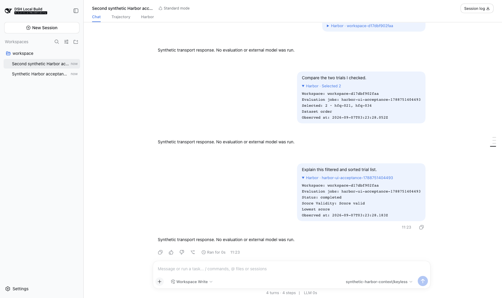
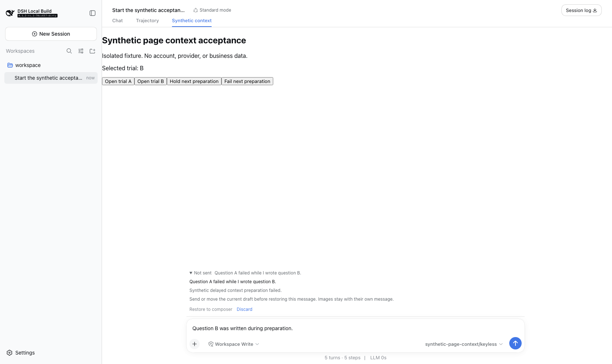

# 普通消息自动附带页面上下文：验证记录

日期：2026-09-07。状态：源码实现与配套宿主联调；未提交、未发布。此记录不修改 0.9.3 的历史发布结论，也不代表完整 PRD 验收。

## 本次变化

在 Harbor 看一个 Trial，直接在原生输入框提问即可。发送瞬间冻结页面和选择，原问题、图片与上下文在同一条消息中接纳和记录。不新增 Composer、Context Capsule 或 Copilot 面板。发送后的上下文只占气泡内一条可展开附件；复制只复制用户原话。

`问 AI` / `@harbor` 显式引用优先。离开 Harbor、关闭页面内的自动附带或使用斜杠命令，不添加隐式 Harbor 上下文。准备失败保留草稿；重试重新捕获当前页面。未接纳消息可被停止、超时、卸载和会话释放取消，已经接纳的消息不会因回执较晚而误恢复为草稿。

本次易用性优化补齐了多选、列表筛选与排序、可读附件、失败消息找回和重启后的引用恢复。多选冻结发送时已经勾选的具体成员，不因之后翻页或筛选而扩大。失败 A 到达时若正在写 B，A 单独保留在原生输入框的“未发送消息”条目中，不覆盖 B。浅色文档预览也修复了文字对比度。

## 环境与边界

- Harbor：`0.9.3` 源码工作区，基线提交 `ee9bd3ef15667c27f1b156042e0bb01733f8bcb0` 加本次未提交改动。
- 爱鸭宿主：基线提交 `70cc6570c44e356100c3947ac1b7e303801c23dd` 加本次未提交改动；macOS、Node 22.22.2、pnpm 11.7.0。
- Harbor 浏览器包 SHA-256：`ef97477db1e0f842ae54f93bfb0f15a7d6aba56d8f8e10b39f69de6002e978ad`。
- 真正加载 Loader、构建后的客户端、原生 Composer、Host 接纳、Harbor 正式工具与 Session 持久化。Trial 数据和模型传输是明确标记的合成测试数据，模型不会联网。
- 不使用现有 Profile、真实用户会话、付费模型、Candidate 或 Docker 评测，不修改发布流程。
- 必须配套支持 `conversation.contexts.register` 的宿主。单独升级 npm 插件不能让旧 rc.8 宿主支持自动上下文；旧宿主保留显式引用和升级提示。
- 新绑定的页面与选区引用保存到项目 `.harbor/private/page-contexts/`，按 Session 隔离；只保存身份、修订与筛选摘要，不保存证据正文、凭据或自由搜索原文。目录与文件采用私有权限，并在该目录内设置 Git 忽略规则。内存缓存的 15 分钟到期不再使这些引用失效。
- 持久化不是证据备份：换 Session、移动项目、删除或破坏记录不能自动恢复。旧版仅存在内存中的 token 不迁移。证据变化仍报告漂移或拒绝失效选区，不悄悄改绑；写入与执行仍需各自审批。
- 准备发送或显式绑定时就可能保存引用元数据，即使消息最后未接纳；目前不自动清理这些记录。失败消息找回则只在当前浏览器会话中保留，不是可跨刷新恢复的持久化发件箱。

## 实际结果

[机器验证记录](acceptance.json) 保存已脱敏的输入块和断言摘要，不含真实凭据或业务内容。

| 操作 | 预期与实测 |
| --- | --- |
| 打开 Trial A，直接提问，不点 Ask AI / @ | 自动引用 `hfq-021`；受控模型实际调用 `harbor_resolve_page_context`，正式工具返回同一 Session 的 A |
| 切到 B，再发普通问题 | 前一条仍解析 A；新消息解析 `hfq-034` |
| 在 Chat 页面发消息 | 没有隐式 Harbor 引用 |
| 显式引用 A，再切 B 发送 | 只有显式 A，没有叠加 B |
| 真实 Job 暂时不可读，再发送 | 未接纳消息、未调用模型，原问题保留；恢复 Job 后可重试 |
| 多选 A、B 后直接提问 | 正式 resolver 返回固定成员 `hfq-021`、`hfq-034`；不会只附带当前打开的单个 Trial |
| 只看列表，改变状态、有效性与排序后提问 | 附带 `completed`、有效与 `lowest-score`，不传自由搜索原文；之后清空筛选不改变旧附件 |
| A 准备失败时正在写 B | A 可见且独立保存，B 不变；B 未清空时禁用恢复，之后可恢复 A 并按当前页面重新发送 |
| 导航与浏览器刷新后展开旧消息附件 | 仍显示发送时的 Trial、选区、筛选和观测时间，不显示协议 token 原文 |
| 实际卸载再加载 Harbor 插件 | 原 Session 的 token 与固定选区仍可读取；这不是整个 Host 进程重启测试 |
| 独立 Node 子进程创建新的 EvolutionService | 超过 15 分钟内存缓存期限后，同项目、同 Session 的快照和固定选区仍可恢复；另测漂移与私有存储边界 |
| 新建第二个 Session | 第二个 Session 使用自己的页面；拒绝第一个 Session 的 token |
| 核对 Harbor 场景的模型输入与日志 | 10 条已接纳用户消息的内容块逐项相等；正式工具延续不计作新用户消息。通用宿主的 A/B 恢复另有独立记录 |
| 通用宿主仅图片发送 | 图片、空用户文本和独立页面上下文同时保留；气泡不显示协议原文 |
| 浅色主题文档预览 | 正文与标题实际计算颜色为 `rgb(15, 17, 21)`、白色背景，对比度约 18.9:1 |

## 关键过程图

图 01–04、06 是真实 Harbor 插件页面和原生对话，数据和回答为合成；图 05、07 是通过 Loader 加载的通用能力测试插件，不冒充 Harbor 页面。截图没有重绘或后期修改。图 04 展示明确的失败提示与保留的草稿，消息未接纳还由机器记录验证，不能仅凭截图断言。图 01/03/04 已刷新到文档预览对比度修复后的界面。

### 01 — 查看 A，直接输入普通问题


### 02 — 同一条原生消息，紧凑页面附件


### 03 — 显式 A 优先于当前 B


### 04 — 失败后原问题仍可重试


### 05 — 通用宿主的图片与页面上下文共存


### 06 — 多选与列表筛选都有可读的冻结附件



### 07 — 失败 A 可找回，正在输入的 B 不被覆盖



## 重复验证

先构建配套的爱鸭源码，再在 Harbor 仓库执行。脚本仅运行 opt-in 的无密钥应用级验收，不安装 Profile，不发布，也不是新增发布门禁。默认比较已提交快照；只有明确接受 UI 变化时才使用 `--refresh`。

```bash
node packages/dsh-plugin/scripts/automatic-context-acceptance.mjs \
  --harness-root /absolute/path/to/xiaohui-harness \
  --screenshots /absolute/path/to/verification/screenshots \
  --evidence /absolute/path/to/verification/acceptance.json
```

Harbor `npm run check`：589/589 通过。宿主 GUI：283 文件、3947 通过、1 项跳过。本功能两条应用级 lane 的 2 文件、5 用例在 11:16 refresh 后，于 11:20 和 11:23 连续两次 replay 全部通过（北京时间）。通用 lane 默认在宿主 CI 可运行，真实 Harbor lane 必须显式指定源码目录。

回放期间修正了测试夹具的两处不稳定因素：展开附件后的滚动位置等待几何稳定；`@harbor` 等待精确候选及异步绑定后的真实引用标签，而非误选最先返回的文件候选。没有删除显式引用优先、固定成员、失败不接纳和原问题保留等业务断言。脚本在两条 lane 均成功后才汇总机器记录，失败运行不覆盖完整记录。

宿主完整构建成功（220 个客户端产物）；`test:docs` 15/15、`doc-sync` 32/32 通过，`lint` 成功。按宿主文档规范补齐接口说明、英中配对文档和决策记录。Harbor `npm pack --dry-run --json` 成功，新上下文模块被纳入包内容，没有发布包。

前一轮完整 `DSH_SNAPSHOT=replay DEEPSEEK_API_KEY='' HARBOR_PLUGIN_ROOT=... pnpm run test:web` 完成了完整构建，并运行 96 个 Web 测试文件：94 通过、2 失败；316 个用例通过、1 失败、14 跳过，另有一个 suite 在 setup 阶段失败。本功能当时的两个文件通过。本次优化没有重新运行全部 Web 文件，也未修复这两项，不能声称当前全量 Web 全绿：`remote-welcome.e2e.ts` 的本机测试服务登录请求经 `127.0.0.1:7890` 代理时返回 `UND_ERR_SOCKET`；仅对子进程绕过代理后仍在 `198.18.x` 测试服务地址遭遇 socket 关闭。`hmr-live.e2e.ts` 的 `dev:web` 在 Node 22.22.2 下由 `import-without-cache` 加载钩子抛出 `ERR_INVALID_RETURN_PROPERTY_VALUE`，在应用 ready 前退出；独立 import/help 检查没有复现同样错误，根因尚未进一步定位，不能声称已证实为基线故障。未修改用户代理、DNS 配置或替换该依赖。

上述范围不是新版本发布、真实提供方推理质量或完整 PRD 验收。
