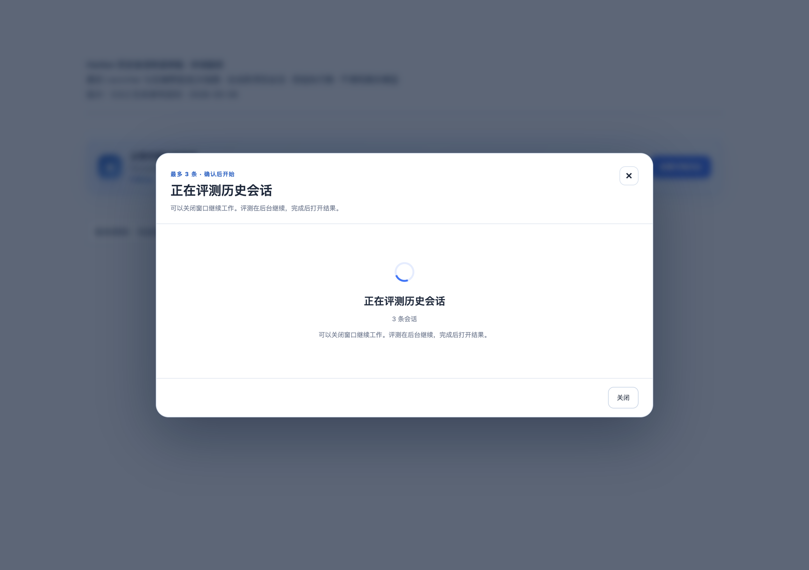
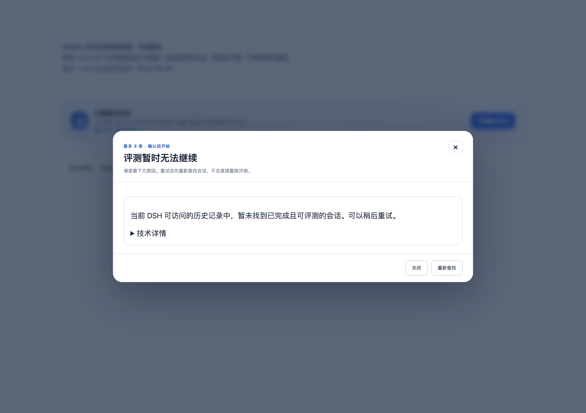

# 历史会话快速体验：修复与验证记录

状态：源码已修复，尚未提交、发布或更新用户已安装的插件。截图及测试执行于 2026-09-06（Asia/Shanghai），记录整理于 2026-09-07。

后续交付：上述为本记录形成时的状态。合并后的 0.9.3 已另补公开工具 scope 隔离与延迟刷新完成跳转回归；最终测试和公开发布状态见[版本图集](../../releases/v0.9.3/README.md)。下方原始截图不作为这两项补修的证明。

## 用户体验改变

点击「评测最近会话」后，自动从当前 DSH 可访问的历史记录中选择最多 3 条已完成会话。用户不需要知道会话文件存在哪里，也不需要选择来源目录、项目或日期。简短预览说明所选会话、评审模型及费用；确认后后台评测已有对话，不重新执行原任务。

此前虽已调用 DSH Session Query，却强制按评测输出目录过滤来源，因此当前目录没有会话就误导用户更换目录。现在 Web 快速入口使用 `dsh-history`，来源与评测输出目录分离；原 Agent 工具默认的 `exact-cwd` 行为保持兼容。

当前会话、子会话、未完成或已中止会话、没有直接用户输入或助手回答的记录、Harbor 内部评测会话仍不纳入样本。真实读取失败、没有合格记录及扫描窗口未覆盖全部历史分别处理。界面默认只显示中文提示，技术信息折叠，不让用户排查存储目录。

## 环境与证据边界

- 源码基线：`75bb114f812b3660c510e054419c248c1b81d8b8` 加未提交修改；包版本字段仍为 `0.9.2`。共享工作区同时包含原生对话面板精简修改，本记录只验收历史会话入口。
- macOS、Node `22.22.2`、Python `3.12.14`、Chrome；使用已安装且版本匹配的 React / ReactDOM `18.3.1`。未安装依赖、改变 DSH profile、重启用户服务或读取用户真实历史。
- 浏览器通过 web-access 的独立本地测试标签操作，加载实际 `HistoricalLauncher` 源码和样式。实际 HTTP handler、`HistoricalWebController`、`SessionDiagnosticService`、选择器、批次物化链参与运行。
- DSH Session Query、评审模型绑定及最终运行器为测试替身：4 条合成已完成会话来自 4 个不同源项目，评测输出位于独立临时目录，输出目录自身没有历史会话。页面明确标注「合成跨项目会话／受控执行器／不调用真实模型」。共享技术错误组件在该隔离页面中也用简化替身显示，真实组件嵌套位置另由自动化测试检查。
- 没有调用真实模型、Host Broker、Harbor CLI 或 Docker，没有产生模型费用；受控运行结束只验证完成通知和结果导航参数，不验证实际 Job 结果页或模型判分质量。
- 选择器按最新创建的候选分批读取，够用即停止，并保留读取上限。样本内部按最后活动时间排序，不宣称全历史按活动时间选出最新 3 条。未遍历完时预览明确提示抽样边界。
- 截图为浏览器真实捕获，逐张检查可读性；只含合成数据，不含用户原始会话、凭证或业务内容。截图 01–03 为成功路径；补齐最终错误提示后重建本地页面，再捕获 04–05。

## 关键过程截图

### 1. 自动找到跨项目历史，确认前不评测

点击「评测最近会话」，预览出现 3 条会话与受控评审模型。DOM 检查：没有目录、项目、日期输入或选择框。服务计数：1 次预览、4 次历史读取、0 次运行、0 次批次物化。集成测试还检查确认前没有创建 `.harbor`。


### 2. 确认后进入后台运行

点击「确认并开始评测」后显示运行状态。计数变为 1 次运行、7 次历史读取、1 次批次物化：新增的 3 次读取用于重验所选源会话。运行器检查批次为 `dsh-history` 且含 3 条记录后保持等待，未伪造已完成状态。



### 3. 关闭窗口不取消任务，完成后交付结果入口

关闭运行窗口，再通过页面上明确标记的验收控制结束受控运行。实际轮询收到完成状态并调用结果回调，窗口保持关闭。绿色文字是测试页面对回调参数的可见记录，**不是实际 Job 结果页，也不是模型质量验收**。


### 4. 确实没有可用历史时，不要求用户寻找目录

用空 Session Query 返回值启动预览。只出现中文原因和「重新查找」，技术详情默认折叠；没有路径或配置控件。计数为 1 次预览、0 次读取、0 次运行、0 次物化。



### 5. 读取失败不误报为历史不存在

模拟历史正文读取失败。提示明确说明这是读取问题，不是没有历史；没有触发运行。该页面进程累计为 2 次预览、4 次读取、0 次运行、0 次物化，技术详情仍默认折叠。


## 自动化验证与复现

在 `packages/dsh-plugin` 中执行：

```bash
npm run check
node --test test/session-selection.test.js test/session-diagnostic.test.js test/historical-web.test.js test/historical-quickstart.test.js
node --test test/historical-launcher.test.js
```

最终整合检查：客户端构建与语法检查通过，**542 / 542 Node 测试通过，0 失败、0 跳过**。其中选择／服务／Web／跨项目集成定向测试 **42 / 42**，界面状态测试 **17 / 17**。

在仓库根目录执行：

```bash
packages/harbor-plugin/.venv/bin/python -m pytest -o addopts='' -q
git diff --check
```

**318 / 318 Python 测试通过**，差异空白检查通过。根目录与 npm 包内的 Historical Batch schema 同步；旧 v1 `exact-cwd` 批次仍能加载。

主要回归包括：跨项目自动发现、真实当前会话排除、默认 Agent 工作目录语义保留、小批读取和扫描预算、空历史与坏记录区分、源身份变化拒绝、跨 Session／输出目录 token 拒绝、来源 digest 不替换为输出目录、敏感信息脱敏，以及关闭预览、切换工作区和异步启动响应之间的竞态。

本记录不代表真实安装 Host 的端到端验证、真实模型质量评测、完整 PRD 验收或新版本发布。独立测试标签与本次本地预览服务已在结束时关闭；未改变用户原有标签或服务。
