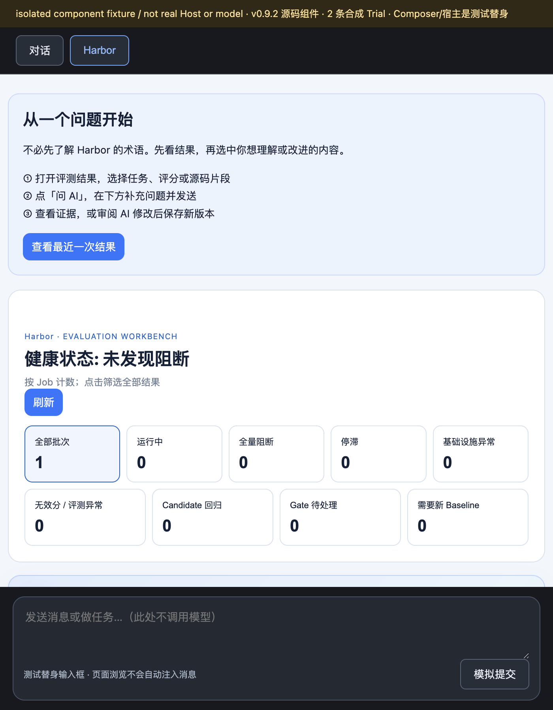
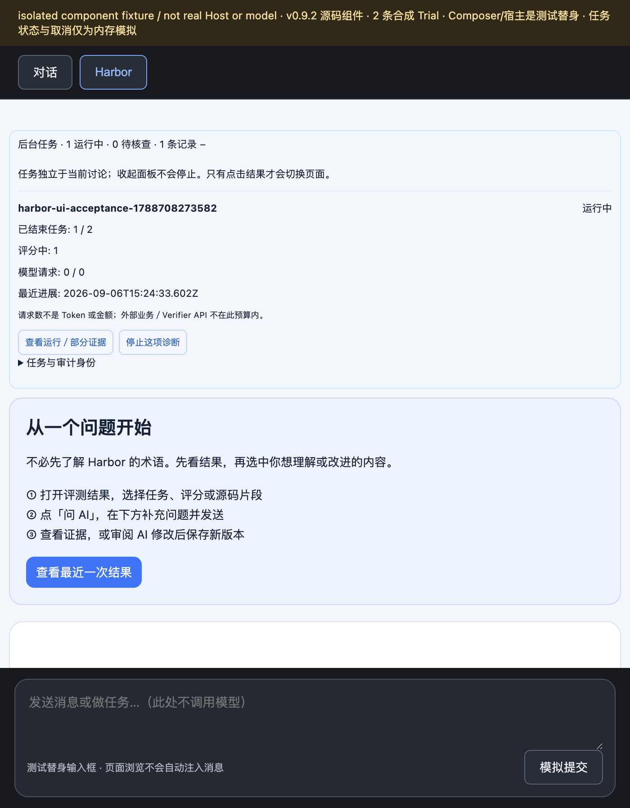
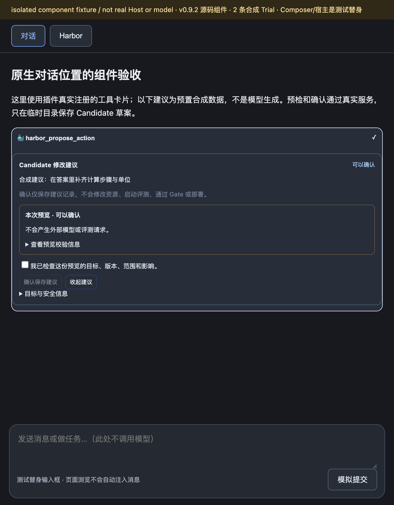
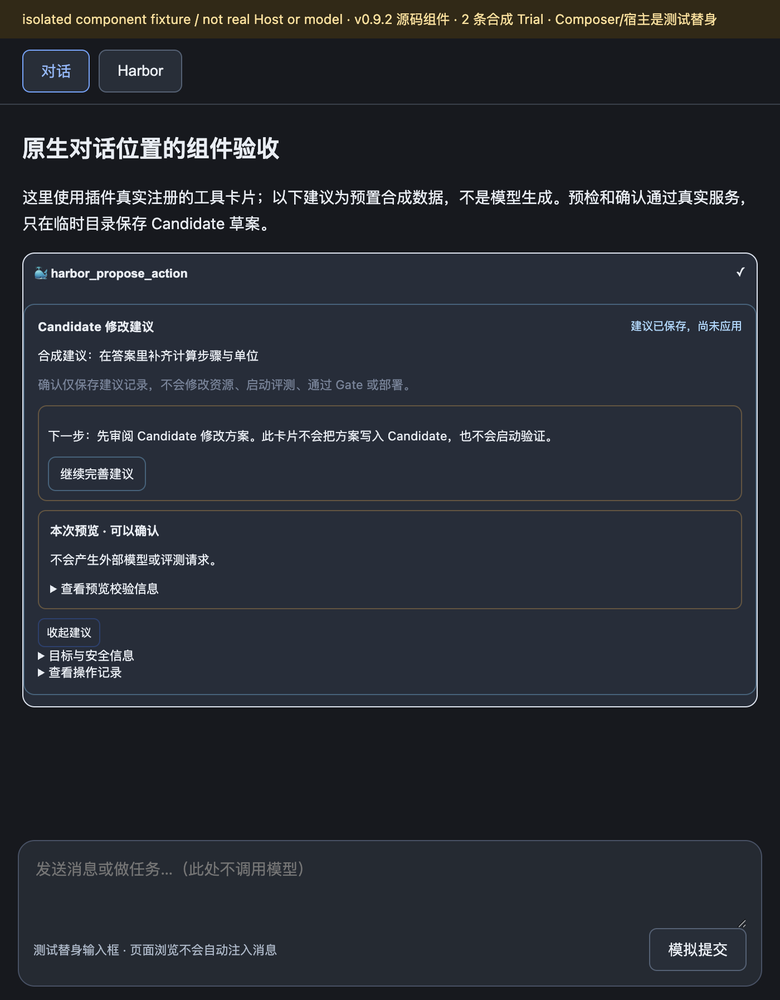

# 原生对话界面精简：修复与验证记录

状态：源码修复，尚未提交或发布。日期：2026-09-06（Asia/Shanghai）。这不是完整 PRD 验收或正式包安装验收。

后续交付：上述为本记录形成时的状态。合并后的 0.9.3 发布验证、重新拍摄的界面及公开包状态见[版本图集](../../releases/v0.9.3/README.md)；下方历史截图和测试结果不重标为新版本实测。

## 本次改变

- 删除输入框上方的 Context Capsule 和 Harbor Copilot 可见面板；工作台恢复单列，不再重复显示 AI 对话。
- 后台任务放回 Harbor 主页面，默认折叠；成功读取且没有任务时完全隐藏。取消、异常核查、恢复确认及查看结果入口保留。
- AI 修改建议使用已有原生对话的工具结果卡，保留预览、人工确认、源码审阅与后续动作。原生结果导航提示打开 Harbor 标签，不宣称自动切换宿主标签。
- 可选的“问 AI”及 `@harbor` 使用原生引用；输入同步组件不输出 DOM，不额外占位。页面浏览不改写用户草稿，也不自动发消息。

**尚未实现自动页面上下文。** 本次检查了本机 DSH rc.8 的公开 `IConversation`、`SessionInput` 和 input-trigger 合约，没有普通消息发送前原子挂载插件页面上下文的通用入口。没有通过私有 Host 状态、发送后注入或自动插入引用来模拟这个能力。

## 环境和证据边界

- 源码基线：`75bb114f812b3660c510e054419c248c1b81d8b8`，加本次未提交修改；包版本字段仍为 `0.9.2`，不是新发布版本。
- macOS、Chrome，浏览器视口 700 × 897 CSS px；截图 1400 × 1794 px。
- 使用现有 React / ReactDOM `18.3.1` 配对依赖，没有安装依赖或改变 DSH profile。最初误选的本机 ReactDOM 19 / React 18 组合不能渲染；预览脚本现已在创建临时目录或监听前检查主版本。
- `native-workbench-preview.mjs` 加载真实插件组件、slot 注册和 HTTP / EvolutionService 处理链；宿主标签与 Composer 是明确标注的测试替身，不是真实 DSH Host。
- 临时工作空间包含 2 条合成 Trial，Job 为 `harbor-ui-acceptance-1788708273582`。预置建议不是模型生成。任务进度和取消是内存模拟，不是实际评测进程或 Docker 取消。
- 建议预览与确认经过真实服务，只向临时工作空间保存 Candidate 建议记录；`COMPLETED` 的结果为 `applied: false`。没有修改 Candidate、运行模型、评测、Gate、部署或发布。
- 截图直接由浏览器捕获并人工检查可读性；仅有合成标识，不含凭证或业务内容。截图是在并行的 Historical Session 改动进入共享目录之前启动的预览进程中采集，不作为该并行改动的验收证据。

## 浏览器关键过程

### 1. 无任务时不显示任务区域，没有两块输入上方面板

打开 `?scene=empty`，成功读取后 `.hse-operation-tray` 数量为 0，旧 Context / Copilot 面板数量为 0；单列宽度为 680px。底部仅有测试替身 Composer。



### 2. 任务控制位于插件页面内

打开 `?scene=tasks`，默认只显示折叠的任务入口；展开后显示一个合成运行中任务，以及“查看运行／部分证据”和“停止这项诊断”。点击取消后显示“已取消”；点击结果进入该任务精确 Job 的 Trials 页面，Composer 保持空白。取消和导航后的状态通过 DOM 核查，截图只记录取消前的控制入口。



### 3. 原生工具结果卡中审阅建议

打开 `?scene=proposal`，点击“检查并预览”。真实服务返回可审阅预览，未勾选审阅框时“确认保存建议”不可用；没有第二个 Copilot 面板。



### 4. 确认后明确告知“已保存，尚未应用”

勾选审阅框后确认，卡片显示“建议已保存，尚未应用”，提供“继续完善建议”，没有把保存建议描述为已经修改 Candidate 或完成评测。



## 自动化验证和复现

在 `packages/dsh-plugin` 中执行：

```bash
npm run build
node --test test/native-tool-render.test.js test/operation-tray.test.js test/documentation.test.js
node --check scripts/workbench-browser-acceptance.mjs
node scripts/native-workbench-preview.mjs --react-dom /absolute/path/to/matching/react-dom --check
```

原生工具卡、任务区域与文档定向回归 **47 / 47 通过**，覆盖无 DOM 输入同步、错误/伪造工具结果拒绝、准确对象导航、旧卡片恢复、会话 API 所有权、失败通知、空任务隐藏、陈旧状态、取消和审阅恢复。预览脚本 `--check` 验证真实服务读取、预览及仅保存草案，不启动监听或模型。

执行本次单独改动的早期全量测试时 **487 / 487 通过**。收尾阶段共享目录出现另一项 Historical Session 改动，全量测试出现旧 Historical 文案断言与旧 Copilot 文档断言失败；本次已更新自己的文档断言。最后重新构建并全量运行 `node --test --test-reporter=spec`：**533 项中 532 通过，1 项失败**，失败位置为 `test/client.test.js:114`，旧断言仍在 `index.jsx` 内查找已被并行改动移入 `historical-launcher-state.js` 的 Historical 文案。未覆盖该并行修改；后续的旧 10 条预览断言也需要随其 3 条默认值一起核对。并行改动及其整合全量结果需单独确认，不能用定向通过替代整个工作区全绿。

后续整合更新（2026-09-07）：Historical Session 任务已更新对应旧文案／10 条预览断言，重新执行 `npm run check` 全量 **542 / 542 通过**，Python **318 / 318 通过**。详细边界见[历史会话快速体验记录](../historical-quickstart/README.md)。上述 532/533 是整合前的历史结果，不再代表当前工作区测试状态。

未执行：真实 Host 安装/刷新验收、普通消息自动绑定页面、真实模型与 Candidate 评测、Docker 取消恢复、完整键盘/屏幕尺寸矩阵、原有 100-Trial 实机验收脚本。源码修复不等于用户当前已安装包已更新。
